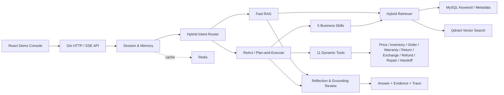

# CleanCare Agent

面向扫地机器人、空气净化器、净水器和加湿器场景的电商客服 Agentic RAG 项目。后端使用 Go 构建，前端提供 React 演示控制台，覆盖商品问答、多约束推荐、配件兼容、故障诊断、订单查询、保修核验、退货、换货、退款、维修进度和人工接管等完整链路。

项目重点不是简单封装大模型接口，而是演示如何把静态知识、动态业务事实、受控 Agent 编排、证据校验、离线评测和可观测性组合成一套可运行的工程系统。

> 当前仓库使用 mock 商品与业务数据，适合本地开发、架构验证和面试展示，不代表已接入真实电商生产系统。

## 项目展示


图中展示当前前端的清洁电器售后对话、订单/保修/故障卡片、人工接管入口和 Evidence ID 引用。Agent Pipeline 与 Trace 仍可在右侧抽屉和 Trace 页面查看，系统在证据不足时会明确说明缺失信息。

## 核心能力

- **三种运行模式**：支持 `bootstrap`、`naive_rag` 和 `agentic`，便于基线对比与渐进式开发。
- **混合 Agent 编排**：简单事实问题走快速 RAG，复杂任务进入受控 Skill、ReAct 或 Plan-and-Execute，ReAct 最多执行 5 步。
- **混合检索链路**：MySQL 关键词检索 + Qdrant 向量检索 + RRF 融合 + 可降级 Rerank，并支持结构化参数优先查询。
- **动静数据隔离**：商品参数、故障树和售后政策进入知识库；价格、库存、订单、保修、退换、退款和维修进度通过 Tool 实时查询或受控提交。
- **安全与可信回答**：包含 Prompt Injection 拦截、安全停止条件、Evidence ID、数值证据检查、LLM Reflection 和确定性 Grounding Review。
- **工程化工具调用**：11 个动态工具通过 MCP `initialize`、`tools/list` / `tools/call` 执行，支持进程内、Streamable HTTP、stdio 和多 server 聚合；聚合后的 `<server>/<tool>` 名称会按逻辑工具名兼容 Agent 白名单，并具备 JSON Schema、超时、重复调用检测、幂等、结果校验和敏感工具审计。
- **售后闭环**：订单、保修、退货、换货、退款、维修进度和 `handoff_to_human` 工具可被统一编排；创建工单、退换货和人工接管等动作需要明确确认。
- **可配置业务 Skill**：内置商品对比、选购推荐、配件查询、故障诊断和售后判断 5 类工作流。
- **模型容错**：支持 OpenAI-compatible LLM、Embedding 和 Reranker，多供应商 fallback、三态熔断与本地降级。
- **评测闭环**：内置 300 条 v2 单轮评测（200 regression / 75 tuning / 25 holdout）、50 条售后多轮评测和 20 条越权攻击评测，输出 pass rate、tool accuracy、false action rate 和 PII leak rate。
- **可视化演示**：React 前端提供流式对话、订单/保修/故障/人工接管卡片、执行流水线、Trace、知识库、评测和 Prompt 管理页面。

## 系统架构



核心执行链路：

```text
HTTP/SSE -> Session -> Intent Router -> Query Rewrite
         -> Fast RAG / Skill / ReAct / Plan-and-Execute
         -> Retriever / Tool Executor -> Evidence Collector
         -> Reflection / Grounding Review -> Answer -> Agent Trace
```

## 当前资产

| 项目 | 当前规模 |
|---|---:|
| Mock 知识文档 | 143 篇 |
| v2 单轮评测案例 | 300 条（200 regression / 75 tuning / 25 holdout） |
| 售后多轮评测案例 | 50 条 |
| 越权攻击评测案例 | 20 条 |
| 评测难度分布 | simple 120 / medium 105 / hard 75 |
| 动态工具 | 11 个 |
| 业务 Skill | 5 个 |
| Prompt 场景模板 | 12 类 v3 模板 |
| 前端页面 | 对话、订单/保修/故障/人工接管卡片、Trace、概览、知识库、评测、Prompt |

支持入库的文档格式包括纯文本、Markdown、HTML、JSON、CSV、Excel、DOCX 和 PDF。

## 技术栈

| 层级 | 技术 |
|---|---|
| Backend | Go 1.26、Gin、Viper、Zap |
| Frontend | React 19、TypeScript 6、Vite 8 |
| Database | MySQL 8.4 |
| Cache / Memory | Redis 7.4 |
| Vector Store | Qdrant 1.13 |
| Model Protocol | OpenAI-compatible Chat / Embedding / Rerank |
| Observability | OpenTelemetry、Prometheus、Agent Trace |
| Quality | Go Test、Race Test、Vet、ESLint、GitHub Actions |

## 快速开始

### 1. 环境要求

- Go 1.26
- Node.js 22+
- Docker Desktop

### 2. 启动基础设施

```powershell
docker compose up -d redis qdrant
docker compose ps
```

Compose 默认创建以下本地服务：

| 服务 | 地址 | 默认账号 |
|---|---|---|
| Redis | `127.0.0.1:6379` | 无密码 |
| Qdrant | `http://127.0.0.1:6333` | 无 API Key |

### 3. 创建本地配置

```powershell
Copy-Item configs/config.local.example.yaml configs/config.local.yaml
$env:CLEANCARE_MYSQL_DSN = "cleancare:cleancare@tcp(127.0.0.1:3306)/cleancare?parseTime=true&charset=utf8mb4&loc=UTC&multiStatements=true"
```

`config.local.example.yaml` 默认启用 MySQL、Redis、Qdrant 和 `agentic` 模式；MySQL 需使用本机或外部实例，Compose 不再内置创建 MySQL。真实 API Key 应通过 `CLEANCARE_*` 环境变量注入，不要提交到仓库。

### 4. 初始化数据

```powershell
go run ./cmd/migrate
go run ./cmd/seed
go run ./cmd/kb-seed
```

也可以使用：

```powershell
make migrate
make seed-all
```

### 5. 启动后端

```powershell
go run ./cmd/server
```

健康检查：

```powershell
Invoke-RestMethod http://127.0.0.1:8080/health/ready
```

可选：将内置业务工具拆到独立 MCP 进程运行：

```powershell
go run ./cmd/mcp-server
```

主服务连接独立 MCP server 时配置：

```yaml
tool:
  mcp:
    transport: http
    endpoint: http://127.0.0.1:8090/mcp
    api_key: change-me
```

stdio MCP server 示例：

```yaml
tool:
  mcp:
    transport: stdio
    stdio_command: go
    stdio_args: ["run", "./cmd/mcp-server"]
    stdio_env:
      CLEANCARE_TOOL_MCP_SERVER_TRANSPORT: stdio
```

多个 MCP server 可通过 `tool.mcp.servers` 聚合；当配置多于一个 server 时，暴露工具名会加上 `<server>/<tool>` 前缀避免命名冲突，Agent 白名单和重复调用检测按逻辑工具名兼容短名与聚合名。独立 MCP server 支持 `initialize` / `notifications/initialized` 生命周期、`Mcp-Session-Id`、`MCP-Protocol-Version`、SSE notification stream、Bearer / `X-MCP-API-Key` 校验和 OAuth protected-resource metadata；本仓库不内置完整 OAuth 授权码发放服务器，可通过 `authorization_servers` 指向外部授权服务器。

### 6. 启动前端

打开另一个终端：

```powershell
Set-Location clean-care-frontend
npm ci
npm run dev
```

访问：

- 前端控制台：`http://127.0.0.1:5173`
- 后端 API：`http://127.0.0.1:8080`
- Qdrant Dashboard：`http://127.0.0.1:6333/dashboard`

Vite 开发服务器会把 `/api` 请求代理到 `8080`。本地配置默认关闭鉴权；启用鉴权后，用户接口使用 JWT，管理员接口使用 `X-Admin-API-Key`。

## Docker 启动后端

`app` 服务位于可选 profile 中，可启动 Redis、Qdrant 和 Go 后端；默认以 `bootstrap` 模式运行，不依赖 Compose 内置 MySQL：

```powershell
docker compose --profile app up -d --build
```

完整 `agentic` 模式仍需要外部 MySQL DSN，并需执行 `go run ./cmd/migrate`、`go run ./cmd/seed` 和 `go run ./cmd/kb-seed` 写入演示数据。前端当前作为独立 Vite 工程运行，不包含在 Compose 中。

## 生产主链路

生产环境必须设置 `CLEANCARE_APP_ENV=production`。后端会在生产模式下快速拒绝演示配置，包括关闭认证、`bootstrap` agent、`memory` 会话仓库、内置 mock 知识库、`local_hash` embedding、`extractive` LLM、`mock` 工具数据等。

后端发布流程：

```powershell
go test ./...
go run ./cmd/migrate
docker compose --profile app up -d --build
Invoke-RestMethod https://<api-host>/health/ready
```

生产中 `CLEANCARE_MYSQL_AUTO_MIGRATE` 应保持 `false`，迁移作为独立 job 在应用发布前执行。Schema 变更、知识库重建或向量迁移前必须备份 MySQL、Redis 和 Qdrant。回滚时应用镜像和前端静态资源可独立回退；数据库只能通过已评审的反向迁移或恢复点处理。

前端不打进后端镜像，按静态资源独立发布：

```powershell
Set-Location clean-care-frontend
npm ci
npm run build
```

将 `clean-care-frontend/dist` 发布到 nginx 或 CDN，并通过 TLS 反向代理把 `/api/*` 转发到 Go API。前端使用相对 `/api/v1` 地址，生产 API base URL 由反向代理控制。私有 API 响应应使用 `Cache-Control: no-store`；service worker、CDN 和全局内存缓存都不能缓存 `/api` 私有会话或 admin 数据。CSP 只允许已部署的静态资源域名和 API 域名；admin API key 不得持久化到浏览器存储。

上线质量门槛：

```powershell
go test ./...
Set-Location clean-care-frontend
npm ci
npm run build
```

`clean-care-frontend` 带有独立 `go.mod`，因此仓库根目录执行 `go test ./...` 不会递归扫描前端 `node_modules`。

## 模型配置

默认本地配置无需外部模型：

```yaml
embedding:
  provider: local_hash

reranker:
  provider: local_lexical

llm:
  provider: extractive
```

接入真实模型时可配置任意 OpenAI-compatible 服务：

```powershell
$env:CLEANCARE_LLM_PROVIDER = "openai_compatible"
$env:CLEANCARE_LLM_ENDPOINT = "https://example.com/v1/chat/completions"
$env:CLEANCARE_LLM_API_KEY = "your-api-key"
$env:CLEANCARE_LLM_MODEL = "your-model"
$env:CLEANCARE_PROMPT_ENABLE_LLM_COMPONENTS = "true"
```

Embedding 与 Reranker 也支持独立端点和 fallback。同一供应商域名下，Reranker
未单独配置 Key 时可安全复用 Embedding Key；跨域名不会复用。完整字段见
[`configs/config.example.yaml`](configs/config.example.yaml)。

## 主要 API

### 用户接口

```text
POST /api/v1/conversations
GET  /api/v1/conversations/{id}/messages
POST /api/v1/conversations/{id}/messages
POST /api/v1/conversations/{id}/messages:stream

GET  /api/v1/products
GET  /api/v1/products/{product_code}
GET  /api/v1/orders/{order_no}
POST /api/v1/after-sales/tickets
```

SSE 使用 `status`、`evidence`、`delta`、`done` 和 `error` 事件。创建售后工单、退货、换货和人工接管等有副作用动作必须显式确认，并提供幂等键；敏感工具结果会进入审计日志并做隐私脱敏。

### 管理接口

```text
POST /api/v1/admin/kb/documents
POST /api/v1/admin/kb/upload
POST /api/v1/admin/kb/search
GET  /api/v1/admin/traces/{trace_id}

POST /api/v1/admin/eval/runs
POST /api/v1/admin/eval/comparisons
GET  /api/v1/admin/eval/comparisons/{comparison_id}
GET  /api/v1/admin/eval/runs/{run_no}

GET  /api/v1/admin/prompts
POST /api/v1/admin/prompts/{scenario}/activate
POST /api/v1/admin/prompts/eval

GET  /api/v1/admin/circuit-breakers/status
POST /api/v1/admin/circuit-breakers/reset
GET  /api/v1/admin/metrics/agent
GET  /api/v1/admin/metrics/prometheus
```

## 评测与可观测性

重新生成内置 v2 数据集：

```powershell
go run ./cmd/eval-dataset -output docs/eval/eval-cases-v2.json
```

启动原 200 条 regression Agentic 回归或 Naive RAG 对比：

```powershell
make eval-regression
make eval-compare
```

生成当前 MCP HTTP 链路的 200 条 regression 单轮回归报告：

```powershell
make e2e-agentic-mcp-eval SYSTEM_VERSION=agentic-aftersales-loop-20260619
```

只跑新增调参集或留出集：

```powershell
make eval-regression-report EVAL_SPLIT=tuning EVAL_MAX_CASES=75 SYSTEM_VERSION=agentic-tuning
make eval-regression-report EVAL_SPLIT=holdout EVAL_MAX_CASES=25 SYSTEM_VERSION=agentic-holdout-final
```

生成售后多轮和越权攻击评测报告：

```powershell
python scripts\eval-multiturn-context.py --base-url http://127.0.0.1:8080 --cases docs\eval\multiturn-aftersales-cases-v1.json --output docs\eval\multiturn-aftersales-report.md --json-output .e2e\multiturn-aftersales-result.json --request-timeout 180
python scripts\eval-multiturn-context.py --base-url http://127.0.0.1:8080 --cases docs\eval\security-attack-cases-v1.json --output docs\eval\security-attack-report.md --json-output .e2e\security-attack-result.json --request-timeout 180
```

也可以在 GitHub Actions 中手动触发 `eval-regression` workflow；该 workflow 会按计划定时运行，并上传 `.e2e/` 原始结果与 `docs/eval/mcp-regression-report.md`。

若服务已经启动，也可以只调用评测 API 并生成报告：

```powershell
make eval-regression-report SYSTEM_VERSION=agentic-aftersales-loop-20260619
```

定位特定 Bad Case 时可在 `POST /api/v1/admin/eval/runs` 中传入
`"case_ids":["EVAL-046","EVAL-047"]`，无需重复执行无关用例。

评测任务通过 API 异步执行，使用返回的 `run_no` 查询进度和结果。Trace 可记录意图、检索、工具、步骤、Token、延迟、模型和估算成本；Prometheus 接口输出请求、Token、工具和模型相关指标。

当前真实链路结果（2026-06-19）：

| Suite | Cases | Pass Rate | Tool Accuracy | False Action | PII Leak | 记录 |
|---|---:|---:|---:|---:|---:|---|
| 200 单轮 HTTP + LLM | 161/200 | 80.5% | 98.0% | 0.0% | 0.0% | `docs/eval/mcp-regression-report.md` |
| 售后多轮 | 49/50 | 98.0% | 98.0% | 0.0% | 0.0% | `docs/eval/multiturn-aftersales-report.md` |
| 越权攻击 | 20/20 | 100.0% | 100.0% | 0.0% | 0.0% | `docs/eval/security-attack-report.md` |

200 单轮回归的失败类型主要集中在未充分落证的生成、意图识别和检索召回；售后多轮唯一失败为一次无 Trace 的连接断开。历史 100 条本地基线和早期真实模型串行评测仅用于参考趋势，真实模型、Embedding、Reranker 或外部 MCP server 配置变化后，应使用新的 `system_version` 重新生成报告。大规模并发压测仍待执行。

## 项目结构

```text
.
├── cmd/                       # server、mcp-server、迁移、数据种子、评测与 Trace 分析
├── configs/                   # 本地配置、完整配置示例与 Skill 配置
├── internal/
│   ├── agent/                 # ReAct、Plan-and-Execute、Reflection、安全护栏
│   ├── api/                   # Gin API、SSE、管理接口
│   ├── eval/                  # 数据集、评测器、LLM Judge、对比与存储
│   ├── ingest/                # 多格式文档解析
│   ├── intent/                # 规则与 LLM 混合意图路由
│   ├── retriever/             # Hybrid Retrieval、RRF、缓存与重检
│   ├── skill/                 # 5 类业务工作流
│   ├── tool/                  # MCP 工具服务/客户端、Executor 与 11 个内置工具
│   └── trace/                 # Agent Trace
├── clean-care-frontend/       # React + TypeScript 演示控制台
├── docs/                      # 设计、ADR、评测、实验与性能文档
├── compose.yaml
├── Dockerfile
└── Makefile
```

## 验证

后端：

```powershell
go test ./...
go test -race ./...
go vet ./...
```

前端：

```powershell
Set-Location clean-care-frontend
npm run lint
npm run build
```

端到端链路：
```powershell
make e2e-agentic-mcp
```

该链路会通过 Docker Compose 启动 Redis 和 Qdrant，并使用外部 MySQL DSN（CI 中由 GitHub Actions service 提供）启动独立 MCP HTTP server 与 API；脚本会断言 API 连接的是远程 MCP endpoint，并覆盖价格、库存、订单、售后建单、纯 KB 检索和澄清链路的 Trace 与工具调用。

GitHub Actions 会执行模块文件检查、后端测试与构建、前端 lint 与构建、Docker 镜像构建，以及基于 Docker Compose 的 Agentic MCP 端到端链路测试；完整 200 条 regression MCP 回归由独立 `eval-regression` workflow 手动或定时执行。

## 项目边界

- 动态价格、库存、订单、保修、退换、退款、维修和人工接管数据均为本地 mock 数据，工具结果和 Trace 会标记
  `data_scope=mock`，未接真实 ERP、支付或物流系统。
- 工具发现和调用已走 MCP `initialize`、`tools/list` / `tools/call` 抽象；默认使用进程内 MCP server，也可通过 Streamable HTTP、stdio 或多 server 聚合接入独立/外部 MCP server。当前内置工具仍使用本地业务数据；OAuth 仅覆盖 protected-resource metadata 与 Bearer/API key 校验，不内置授权码、token introspection 和 scope 到 tool 的完整授权系统。
- React 界面是开发与演示控制台，不是具备完整 RBAC、OIDC 和审计能力的生产管理后台。
- Prompt 版本由进程内 Registry 管理，重启后不会持久化激活状态。
- Cross-Encoder Reranker 依赖外部兼容服务，仓库不内置模型推理服务。
- 尚未完成生产级 SLA、跨机房容灾、真实支付物流联调和大规模压力测试。

## 相关文档

- [系统设计](docs/clean-care-agentic-rag-design.md)
- [架构决策记录](docs/architecture-decisions.md)
- [项目完成度与边界](docs/project-status.md)
- [性能基准](docs/performance-benchmark.md)
- [MCP HTTP 回归评测记录](docs/eval/mcp-regression-report.md)
- [售后多轮评测报告](docs/eval/multiturn-aftersales-report.md)
- [越权攻击评测报告](docs/eval/security-attack-report.md)
- [早期真实模型 200 条评测报告](docs/eval/llm-experiment-report.md)
- [历史评测报告](docs/eval/experiment-report.md)
- [面试说明](docs/interview-notes.md)
