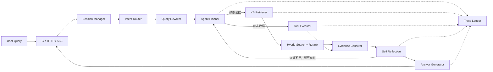

# 清洁电器电商客服 Agentic RAG 系统设计

> 文档定位：面向简历项目、技术面试和实际开发的初版设计。  
> 项目边界：只覆盖扫地机器人、空气净化器、净水器、加湿器，首期重点是扫地机器人和空气净化器。  
> 工程定位：Go 模块化单体，不包装成已经支撑大规模生产流量的完整电商系统。

## 0. 一页项目摘要

### 0.1 项目名称候选

1. **CleanCare Agent - 清洁电器智能导购与售后系统**
2. **CleanCare Advisor - 清洁电器 Agentic RAG 客服平台**
3. **HomeClean Support AI - 清洁电器导购与故障诊断系统**

后续文档统一使用 **CleanCare Agent**。

### 0.2 一句话定位

CleanCare Agent 是一个用 Go 实现的清洁电器垂直领域客服后端：它通过知识库检索回答商品参数、对比、兼容、说明书和政策问题，通过受控 Agent 调用价格、库存、订单、保修和售后工单工具，处理需要多文档、多步骤和实时数据的用户请求。

### 0.3 初版固定技术选型

| 层次 | MVP 选型 | 选择理由 |
|---|---|---|
| HTTP | Go + Gin | 路由、中间件、SSE 实现直接，适合展示 Go Web 工程能力 |
| 配置/日志 | Viper + Zap | 配置分环境管理，结构化日志便于 trace 和 bad case 分析 |
| 事务数据 | MySQL 8 | 商品、订单、会话、文档元数据、评估和日志 |
| 缓存/会话/队列 | Redis + Redis Stream | MVP 同时覆盖短期记忆、限流、异步文档入库，部署成本低 |
| 向量库 | Qdrant | 过滤能力和 Go SDK 足够，单机 Docker 部署比 Milvus 更轻 |
| 检索 | Qdrant dense vector + MySQL FULLTEXT/应用层 BM25 服务 | 支持语义召回、关键词召回和 metadata filter |
| LLM | Qwen / DeepSeek，OpenAI-compatible HTTP API | Go 后端只依赖统一模型接口，不与具体供应商 SDK 耦合 |
| Embedding | BGE 或 text-embedding-v3 | 通过 `EmbeddingClient` 抽象切换 |
| Rerank | bge-reranker 或 gte-rerank | 对混合召回 TopN 统一精排 |
| 可观测性 | OpenTelemetry + trace/span，日志先落 MySQL | MVP 可本地查看，进阶可接 Jaeger/Tempo |
| 输出 | SSE | 支持答案 token、阶段状态、引用和结束事件流式返回 |

不在 MVP 同时维护 Qdrant/Milvus、Kafka/Redis Stream 两套实现。接口保留替换能力，代码只完成一套。

## 1. 项目定位

### 1.1 用户是谁

1. **买前用户**：正在选择扫地机器人、空气净化器等清洁电器，希望确认参数、比较型号、组合家庭条件获得推荐。
2. **已购用户**：需要查使用方法、耗材兼容、故障排查、订单、退换货条件和保修状态。
3. **客服或运营人员（次要）**：通过 Agent Trace 和 bad case 记录理解回答依据，维护知识库和评估集。

系统不是商家 ERP，也不服务服装、食品、手机、生鲜等全品类业务。

### 1.2 解决的具体问题

| 用户困难 | 系统能力 |
|---|---|
| 买前不知道选哪款 | 提取面积、宠物、地毯、预算、过敏等约束，检索多款商品并给出有证据的推荐 |
| 想对比两款商品 | 从参数表、对比表和使用场景中聚合差异，不只拼接两段详情 |
| 想知道某个参数 | 按型号和参数名精确检索，回答吸力、CADR、水箱、噪声等字段 |
| 想知道配件是否兼容 | 检索配件兼容矩阵，区分主机型号、SKU、批次和替代配件 |
| 商品故障不知道如何排查 | 按故障树逐步追问现象，给出安全、可停止、可转售后的诊断步骤 |
| 想判断能否退换货 | 结合订单购买时间、订单状态、商品状态和售后条款进行条件判断 |
| 想查保修和售后流程 | 查询订单与保修工具，必要时在用户确认后创建售后工单 |

### 1.3 为什么普通 RAG 不够

这里的普通 RAG 指“一次改写、一次检索、一次生成”的问答链路。它适合证据集中且不依赖实时状态的问题，但无法稳定完成动态查询和受条件约束的多步骤任务。

| 问题 | 普通 RAG 表现 | Agentic RAG 需要增加什么 |
|---|---|---|
| “T20 吸力多大？” | 参数表中存在单一答案，一次检索即可 | 不进入 ReAct，走快速 RAG |
| “T20 和 X20 Pro 哪个更适合养猫家庭？” | 容易只命中一个型号，或只罗列参数 | 分别检索两款参数、宠物场景指南，再进行维度化比较 |
| “120 平、两只猫、有地毯、预算 5000，推荐一套方案” | 单文档很少同时覆盖所有约束 | 提取约束、召回候选、按硬条件过滤、查询价格/库存、解释取舍 |
| “上周买的净化器滤芯多少钱？有券吗？” | 知识库不知道“那个”指什么，也不知道实时价格 | 查购买记录定位主机，查兼容知识，调用价格工具；优惠券首版只能明确能力边界 |
| “扫地机器人充不进电怎么办？” | 一次给出长故障列表，无法判断用户处于哪个分支 | 根据充电灯、底座供电、触点状态等多轮追问，沿故障树推进 |
| “买了 20 天，包装拆了，还能退吗？” | 只引用“七天无理由”可能误判 | 查订单日期和状态，检索退换条款，区分无理由退货、质量问题和保修 |

Agentic RAG 不是让模型随意行动，而是让它在后端限定的步骤、工具白名单、预算和证据规则内完成任务。

## 2. 业务边界

### 2.1 纳入范围

- 品类：扫地机器人、空气净化器、净水器、加湿器。
- 首期数据重点：扫地机器人 6 款、空气净化器 4 款。
- 首期能力：参数咨询、商品对比、多约束推荐、配件兼容、故障诊断、售后/保修判断。
- 动态数据：mock 价格、库存、购买记录、订单、保修、售后工单。

### 2.2 明确排除

- 服装、食品、手机、生鲜等其他品类。
- 全平台订单中心、支付、复杂物流、投诉、发票。
- 真实优惠券核销。`coupons` 只为 mock 价格展示和后续扩展服务，初版没有 `coupon_query` 工具。
- 真实厂商 IoT 设备诊断、远程控制和维修调度。
- 完整 OAuth 授权码服务器、分布式 Agent 调度、大规模多租户平台。

### 2.3 为什么清洁电器适合 Agentic RAG

1. **参数密集**：吸力、导航、越障、CADR、滤网等级、噪声等字段适合结构化检索。
2. **型号差异明显**：同品牌不同代际存在细粒度差异，天然需要多文档对比。
3. **配件存在兼容矩阵**：尘袋、滚刷、滤芯不是只靠语义相似度就能判断。
4. **说明书可操作**：安装、联网、清洁、复位等步骤可以形成有序知识块。
5. **故障排查是决策树**：需要多轮收集状态，再进入下一诊断分支。
6. **售后是条件判断**：时间、状态、原因、条款版本共同决定结论。
7. **价格和库存会变化**：必须从动态工具读取，而不是相信旧文档。
8. **推荐有多约束**：家庭面积、宠物、地毯、预算等需要检索、过滤和解释取舍。

## 3. 初版核心功能

### 3.1 六个核心能力

1. 商品参数咨询。
2. 商品对比。
3. 多约束选购推荐。
4. 配件兼容查询。
5. 故障诊断。
6. 售后退换货/保修判断。

“使用操作”作为参数/售后相关的辅助问答能力存在，但不单独扩大为第七条核心业务线。

### 3.2 六个动态工具

1. `price_query`
2. `inventory_check`
3. `user_purchase_history`
4. `order_lookup`
5. `warranty_check`
6. `create_after_sales_ticket`

### 3.3 静态知识与动态数据分开

**静态知识**是可版本化、可审核、更新频率较低的内容，如商品参数、说明书、兼容表、故障树和售后政策。它适合经过清洗、分块、Embedding 后进入知识库，并在回答中引用文档版本。

**动态数据**是与用户、时间和业务状态有关的数据，如实时价格、库存、订单和保修。它必须通过有鉴权、有超时、有审计的工具实时查询。

分开的原因：

- 旧价格进入向量库后很难保证及时删除，可能产生错误报价。
- 订单和购买记录含用户私有数据，不能作为公共知识被召回。
- 工具调用可以执行权限校验、参数校验、超时和审计，向量检索做不到。
- 静态知识需要“相似性召回”，动态数据需要“确定性查询”。
- 冲突时有明确优先级：工具实时结果 > 生效中的结构化业务记录 > 最新知识文档 > 模型常识。

## 4. 分层意图体系

### 4.1 一级意图

| 一级意图 | 职责 |
|---|---|
| 售前咨询 `presales` | 参数、对比、推荐、配件、使用、价格、库存 |
| 售后服务 `aftersales` | 订单、保修、退换判断、创建工单 |
| 故障诊断 `diagnosis` | 按故障树进行多轮排查 |
| 闲聊兜底 `fallback` | 澄清、拒答和有限闲聊 |

### 4.2 二级意图

| 二级意图/Go 常量 | 典型问法 | 知识来源 | 工具 | 多步 | 难度 | 路径 |
|---|---|---|---|---|---|---|
| 参数咨询 `IntentProductParameter` | “T20 吸力多大？” | 参数表、详情页 | 否 | 否 | 简单 | Naive RAG |
| 商品对比 `IntentProductComparison` | “T20 和 X20 Pro 差在哪？” | 参数表、对比表、指南 | 否 | 是 | 中等 | Agentic RAG |
| 选购推荐 `IntentPurchaseRecommendation` | “120 平养猫预算 5000 怎么选？” | 参数表、指南、详情 | 价格/库存可选 | 是 | 困难 | Agentic RAG |
| 配件兼容 `IntentAccessoryCompatibility` | “这个滤芯能装 P400 吗？” | 兼容表、参数表 | 否 | 视指代而定 | 中等 | 结构化 RAG/Skill |
| 使用操作 `IntentUsageInstruction` | “怎么重置 Wi-Fi？” | 说明书、FAQ | 否 | 否/短流程 | 简单 | Naive RAG |
| 价格查询 `IntentPriceQuery` | “X20 Pro 现在多少钱？” | 商品/SKU 标识 | `price_query` | 否 | 简单 | Tool |
| 库存查询 `IntentInventoryQuery` | “北京有现货吗？” | 商品/SKU 标识 | `inventory_check` | 否 | 简单 | Tool |
| 订单查询 `IntentOrderQuery` | “我上周买的是哪款？” | 私有业务数据 | `user_purchase_history`/`order_lookup` | 是 | 中等 | Agentic RAG |
| 保修查询 `IntentWarrantyQuery` | “这台还在保吗？” | 保修政策 + 订单 | `order_lookup`、`warranty_check` | 是 | 中等 | Agentic RAG |
| 退换货判断 `IntentReturnEligibility` | “买 20 天拆封了还能退吗？” | 售后政策 | `order_lookup` | 是 | 困难 | Agentic RAG |
| 故障排查 `IntentTroubleshooting` | “机器充不进电” | 故障树、说明书 | 工单工具仅末端可选 | 是/多轮 | 困难 | Agentic RAG |
| 创建售后工单 `IntentCreateAfterSalesTicket` | “帮我报修” | 工单规则 | `create_after_sales_ticket` | 是 | 中等 | Agentic RAG |
| 模糊问题澄清 `IntentClarification` | “那个滤芯呢？” | 会话上下文 | 取决于澄清结果 | 是 | 中等 | Agent 控制 |
| 超出范围拒答 `IntentOutOfScope` | “帮我推荐手机” | 范围规则 | 否 | 否 | 简单 | Guardrail |
| 闲聊兜底 `IntentChitchat` | “你好”“谢谢” | 固定模板/LLM | 否 | 否 | 简单 | Direct |

### 4.3 Go 表示

```go
package intent

type IntentType string

const (
	IntentProductParameter       IntentType = "product_parameter"
	IntentProductComparison      IntentType = "product_comparison"
	IntentPurchaseRecommendation IntentType = "purchase_recommendation"
	IntentAccessoryCompatibility IntentType = "accessory_compatibility"
	IntentUsageInstruction       IntentType = "usage_instruction"
	IntentPriceQuery             IntentType = "price_query"
	IntentInventoryQuery         IntentType = "inventory_query"
	IntentOrderQuery             IntentType = "order_query"
	IntentWarrantyQuery          IntentType = "warranty_query"
	IntentReturnEligibility      IntentType = "return_eligibility"
	IntentTroubleshooting        IntentType = "troubleshooting"
	IntentCreateAfterSalesTicket IntentType = "create_after_sales_ticket"
	IntentClarification          IntentType = "clarification"
	IntentOutOfScope             IntentType = "out_of_scope"
	IntentChitchat               IntentType = "chitchat"
)

type Result struct {
	Primary    string
	Secondary  IntentType
	Confidence float64
	Entities   map[string]string
	NeedClarify bool
}
```

路由采用三级判断：规则命中明确工具/型号词 -> 小模型输出结构化意图 -> 低置信度进入澄清。不会只靠一个大 Prompt 分类。

## 5. 知识库文档体系

### 5.1 文档规模

初版共 **57 篇**：

| 文档类型 | 数量 | 内容与适用问题 | 推荐分块 | 示例标题 |
|---|---:|---|---|---|
| 商品详情页 | 10 | 卖点、场景、规格摘要；参数和推荐 | 按“卖点/清洁能力/基站/适用家庭/限制”标题分块 | 《T20 商品详情》《P400 空气净化器详情》 |
| 商品参数表 | 5 | 多型号标准字段；参数查询、候选过滤 | 每个型号一条结构化记录，同时生成字段文本块 | 《扫地机器人核心参数表》《净化器 CADR 与适用面积表》 |
| 商品对比表 | 5 | 预定义型号组合及差异；商品对比 | 按对比维度分块，每块保留所有被比较型号 | 《T20 vs X20 Pro》《P400 vs A500》 |
| 选购指南 | 5 | 面积、宠物、地毯、过敏、预算；推荐 | 按场景规则和决策条件分块 | 《养宠家庭扫地机器人选购》《过敏人群净化器选购》 |
| 配件兼容表 | 5 | 主机、配件 SKU、批次、替代关系 | 兼容关系逐行结构化，文本块保留整行和限制 | 《扫地机器人耗材兼容矩阵》《净化器滤芯兼容表》 |
| 使用说明书 | 8 | 安装、联网、清洁、维护、复位 | 按操作任务分块，步骤不可拆散 | 《T20 使用说明书》《P400 滤芯更换指南》 |
| 故障排查手册 | 6 | 症状、检查项、分支、停止条件 | 每个故障节点一个块，保存父子节点 ID | 《扫地机器人充电故障树》《净化器异响排查》 |
| 售后政策 | 5 | 退换、保修、耗材、人为损坏、工单 | 按条款+适用条件+例外分块 | 《清洁电器退换货政策 2026Q2》《扫地机器人保修条款》 |
| FAQ | 8 | 高频简问简答和术语解释 | 一问一答或同主题 2-3 问一块 | 《扫地机器人常见问题》《滤芯与耗材 FAQ》 |

商品详情的 10 篇对应首期 10 款重点商品；其他品类只保留少量指南/政策样例，不扩大商品数量。

### 5.2 为什么不能统一固定 512 token

- 参数表的关键单位可能被切到下一块，导致“参数名”和“参数值”分离。
- 对比表必须同时保留多个型号；按长度切分可能只剩单边数据。
- 操作说明和故障树有顺序与分支，截断会让步骤失去前置条件。
- 售后条款的适用条件、例外和结论必须在同一块。
- FAQ 很短，硬凑 512 token 会把不相关问题混在一起，降低召回精度。

因此采用**按文档类型分块**，再设置 200-800 token 的保护范围；超长块优先按语义标题拆，不直接按字符截断。

### 5.3 特殊文档处理

#### 商品参数表

- 原始数据保存为 CSV/JSON，入库时做字段校验和单位归一化。
- MySQL 保存可过滤字段，如 `category`、`brand`、`model`、`price_band`。
- 向量文本使用稳定模板：`型号=T20；吸力=6000Pa；适用面积=...`。
- 参数查询先识别型号和字段，优先精确结构化命中，再用向量召回补充解释。

#### 商品对比表

- 一个 chunk 对应一个维度，例如“宠物毛发处理”“地毯能力”“维护成本”。
- chunk 内始终保留两个或多个型号名称及各自值。
- 用户临时比较的组合不存在时，分别检索每款参数，再由比较 Skill 对齐字段。

#### 配件兼容表

- 兼容关系至少包含 `host_model`、`accessory_sku`、`compatible`、`batch_range`、`notes`。
- 检索时先对主机型号和配件 SKU 做精确过滤，再使用语义检索处理用户俗称。
- 没有明确兼容证据时不得根据“看起来相似”推断兼容。

#### 故障诊断树

- 每个节点保存 `node_id`、`parent_id`、`symptom`、`question`、`expected_answers`、`next_node_ids`、`action`、`stop_condition`、`risk_level`。
- 会话中保存当前 `diagnosis_state`，下一轮只检索当前节点和候选子节点。
- 涉及拆机、漏电、漏水、异味过热时停止自助诊断并建议断电/关水和转人工。

#### 售后政策

- 按“结论 + 条件 + 例外 + 生效时间”分块。
- 检索必须增加 `effective_time <= now < expire_time` 过滤。
- 退换判断输出“适用条款”和“仍需确认的商品状态”，不能只输出肯定/否定。

### 5.4 Metadata

```json
{
  "doc_id": "doc_return_policy_2026q2",
  "chunk_id": "chk_return_opened_20d",
  "product_id": "",
  "category": "cleaning_appliance",
  "brand": "",
  "doc_type": "after_sales_policy",
  "intent_tags": ["return_eligibility", "warranty_query"],
  "version": "2026.2",
  "effective_time": "2026-04-01T00:00:00+08:00",
  "expire_time": "2026-06-30T23:59:59+08:00",
  "source": "mock://policy/return/2026q2",
  "updated_at": "2026-05-20T10:00:00+08:00"
}
```

建议再增加：`model`、`sku_id`、`language`、`section_path`、`content_hash`、`status`、`fault_node_id`。这些字段用于过滤、幂等更新和故障树定位。

不同文档类型的专属 metadata：

| 文档类型 | 额外字段 |
|---|---|
| 商品详情页 | `model`、`sku_ids`、`feature_tags`、`suitable_scenarios` |
| 商品参数表 | `model`、`parameter_group`、`unit_system`、`schema_version` |
| 商品对比表 | `compared_product_ids`、`comparison_dimension` |
| 选购指南 | `scenario_tags`、`budget_range`、`area_range`、`constraint_tags` |
| 配件兼容表 | `host_model`、`accessory_sku`、`batch_range`、`compatibility_status` |
| 使用说明书 | `model`、`operation_name`、`step_range`、`risk_level` |
| 故障排查手册 | `fault_node_id`、`parent_node_id`、`symptom_code`、`risk_level` |
| 售后政策 | `policy_type`、`region`、`effective_time`、`expire_time` |
| FAQ | `question_key`、`topic`、`related_models` |

## 6. Agentic RAG 总体架构



### 6.1 模块职责

| 模块 | Go 后端职责 |
|---|---|
| HTTP/SSE | 参数校验、鉴权、创建 request/trace ID、发送 `status/delta/evidence/done/error` 事件 |
| Session Manager | Redis 读取最近 5 轮和摘要；MySQL 持久化消息；维护故障诊断状态 |
| Intent Router | 规则优先、模型分类补充、置信度阈值和澄清策略 |
| Query Rewriter | 消解“那个/这台/上周买的”等指代，拆分子问题，生成检索 query，不改变用户约束 |
| Agent Planner | 根据意图、复杂度、权限和预算选择 Direct、RAG、Skill 或 ReAct |
| KB Retriever | 执行向量、关键词、metadata filter、去重和不同文档类型的召回策略 |
| Reranker | 对混合召回 Top 20-40 精排，向 Planner 返回 Top 5-8 |
| Tool Executor | MCP 工具发现/调用、Schema 校验、用户权限、超时、幂等、审计和失败映射 |
| Evidence Collector | 统一封装文档块和工具结果，分配 `evidence_id`，记录时效、来源和置信度 |
| Self Reflection | 检查覆盖率、冲突、来源一致性、工具状态和是否需要重试/澄清 |
| Answer Generator | 仅基于 evidence 生成，按结论、依据、限制、下一步组织答案 |
| Trace Logger | 记录意图、计划、检索、工具、反思、模型耗时、token、错误，不保存模型隐式思维链 |

### 6.2 Intent Router

1. 规则层识别订单号、商品型号、明确动作词，如“多少钱”“有货吗”“报修”。
2. LLM 分类层只允许输出 JSON Schema：一级意图、二级意图、实体、置信度、是否需澄清。
3. 路由校验层检查意图与实体是否匹配。例如价格查询没有型号或 SKU 时先澄清。
4. `confidence < 0.65` 或两个候选分差 `< 0.1` 时进入 `IntentClarification`。
5. 范围规则优先于 LLM：手机推荐、发票、投诉等直接拒答并说明支持范围。

### 6.3 Query Rewriter

Query Rewriter 不负责回答，只生成更适合检索和工具调用的表达：

- 原问：“那个滤芯现在多少钱？”
- 上下文：“我上周买了一台 P400。”
- 改写：“查询 P400 空气净化器兼容滤芯的当前价格。”
- 子任务：`定位兼容滤芯 SKU -> 查询实时价格`。

改写结果保存原始 query、独立子问题、已解析实体和未确定实体，避免模型把猜测写成事实。

### 6.4 Agent Planner

- 简单参数、说明书、FAQ：单次 RAG，不进入循环。
- 明确价格/库存：单工具调用。
- 比较、推荐、退换判断：调用固定 Skill；Skill 内允许有限步骤。
- 故障诊断：状态机 + 检索，必要时多轮等待用户输入。
- 未知复杂问题：受控 ReAct，最多 5 步，工具仅来自意图白名单。

### 6.5 混合检索和 Rerank

1. 根据意图生成 metadata filter，例如 `doc_type in (...) AND model in (...)`。
2. Dense 向量召回 Top 20，关键词/BM25 召回 Top 20。
3. 使用 Reciprocal Rank Fusion（RRF，按各列表排名融合）得到 Top 30。
4. Rerank 对 query 和候选 chunk 打分，返回 Top 5-8。
5. 表格/兼容/政策结果增加结构化命中分，避免语义相似内容覆盖精确匹配。

### 6.6 Evidence 和反思

文档块、工具结果统一为证据：

```go
type Evidence struct {
	ID          string         `json:"evidence_id"`
	Kind        string         `json:"kind"` // kb_chunk | tool_result
	SourceID    string         `json:"source_id"`
	Title       string         `json:"title"`
	Content     string         `json:"content"`
	Score       float64        `json:"score"`
	Freshness   time.Time      `json:"freshness"`
	Metadata    map[string]any `json:"metadata"`
}
```

反思不是再让模型自由聊天，而是执行一组可验证检查：

- 用户有几个子问题，当前 evidence 覆盖了几个。
- 关键结论是否存在至少一个可引用证据。
- 动态价格是否来自工具且未超时。
- 不同证据是否在型号、SKU、政策版本上冲突。
- 若分数低，是否还有一次 query 改写和重检预算。

## 7. Go 工程目录

```text
CleanCaregent/
├── cmd/
│   ├── server/                 # HTTP/SSE 服务入口
│   ├── worker/                 # Redis Stream 文档入库与评估任务
│   └── migrate/                # 数据库迁移入口
├── internal/
│   ├── api/                    # Gin handler、DTO、SSE writer
│   ├── middleware/             # auth、request id、限流、recover、日志
│   ├── agent/                  # orchestrator、planner、ReAct runner
│   ├── intent/                 # 意图类型、router、实体提取
│   ├── rag/                    # RAG pipeline、evidence collector
│   ├── retriever/              # dense、keyword、hybrid、filter
│   ├── reranker/               # rerank client 和 fallback
│   ├── tool/                   # registry、executor、6 个工具
│   ├── skill/                  # compare/recommend/accessory/diagnosis/aftersales
│   ├── memory/                 # Redis 短期记忆、摘要和诊断状态
│   ├── llm/                    # Qwen/DeepSeek 统一客户端、prompt 调用
│   ├── embedding/              # BGE/text-embedding-v3 客户端
│   ├── eval/                   # case loader、runner、metrics
│   ├── trace/                  # agent trace、span、token 统计
│   ├── service/                # 会话、商品、订单、知识库应用服务
│   ├── repository/             # MySQL/Redis/Qdrant 数据访问
│   ├── model/                  # 领域实体和持久化模型
│   └── platform/               # clock、id、transaction、HTTP client
├── pkg/
│   ├── errors/                 # 业务错误码
│   └── response/               # 通用响应结构
├── configs/                    # config.local.yaml 等模板
├── migrations/                 # MySQL DDL
├── docs/                       # 设计、API、知识库样例
├── scripts/                    # 数据导入和本地评估脚本
├── testdata/                   # mock 商品、文档、订单、评估集
├── deployments/               # Docker Compose、OTel 配置
├── go.mod
└── Makefile
```

`internal` 防止业务包被外部项目直接依赖；`pkg` 只放真正可复用且不含业务语义的少量包。初版保持模块化单体，不先拆微服务。

### 7.1 核心接口

```go
package ports

type Planner interface {
	Plan(ctx context.Context, req PlanRequest) (*Plan, error)
}

type Retriever interface {
	Search(ctx context.Context, req SearchRequest) ([]SearchResult, error)
}

type Reranker interface {
	Rerank(ctx context.Context, query string, docs []SearchResult, topK int) ([]SearchResult, error)
}

type Tool interface {
	Name() string
	Description() string
	ParamsSchema() json.RawMessage
	Execute(ctx context.Context, call ToolCall) (ToolResult, error)
}

type Skill interface {
	Name() string
	CanHandle(intent intent.IntentType) bool
	Run(ctx context.Context, req SkillRequest) (*SkillResult, error)
}

type MemoryStore interface {
	LoadContext(ctx context.Context, conversationID string, recentLimit int) (*ConversationContext, error)
	AppendMessage(ctx context.Context, msg Message) error
	SaveSummary(ctx context.Context, conversationID, summary string, throughMessageID int64) error
	LoadDiagnosisState(ctx context.Context, conversationID string) (*DiagnosisState, error)
	SaveDiagnosisState(ctx context.Context, state DiagnosisState) error
}

type TraceStore interface {
	Start(ctx context.Context, trace AgentTrace) error
	AppendStep(ctx context.Context, step TraceStep) error
	Finish(ctx context.Context, traceID string, result TraceResult) error
}

type Evaluator interface {
	Evaluate(ctx context.Context, c EvalCase, output AgentOutput) ([]MetricResult, error)
}
```

## 8. 受控 Agent Planner

### 8.1 数据结构

```go
type ActionType string

const (
	ActionAnswerDirect ActionType = "answer_direct"
	ActionRetrieve     ActionType = "retrieve"
	ActionCallTool     ActionType = "call_tool"
	ActionRunSkill     ActionType = "run_skill"
	ActionClarify      ActionType = "clarify"
	ActionReflect      ActionType = "reflect"
	ActionFinish       ActionType = "finish"
)

type PlanRequest struct {
	TraceID          string
	UserID           int64
	ConversationID   string
	Query            string
	RewrittenQueries []string
	Intent           intent.Result
	Context          ConversationContext
	AllowedTools     []string
	MaxSteps         int
	TokenBudget      int
	Deadline         time.Time
}

type Plan struct {
	ID              string
	Mode            string // direct | naive_rag | skill | react
	Intent          intent.IntentType
	Steps           []PlanStep
	MaxSteps        int
	TokenBudget     int
	Confidence      float64
	FallbackMessage string
}

type PlanStep struct {
	StepID     string
	Action     ActionType
	SkillName  string
	ToolName   string
	Query      string
	Params     map[string]any
	ReasonCode string // 可审计原因码，不记录隐式思维链
	DependsOn []string
}
```

### 8.2 规则 + LLM 混合规划

```go
func (p *HybridPlanner) Plan(ctx context.Context, req PlanRequest) (*Plan, error) {
	if time.Now().After(req.Deadline) {
		return nil, ErrPlanTimeout
	}
	if req.Intent.NeedClarify || req.Intent.Confidence < p.minConfidence {
		return p.clarificationPlan(req), nil
	}

	switch req.Intent.Secondary {
	case intent.IntentProductParameter, intent.IntentUsageInstruction:
		return p.naiveRAGPlan(req), nil
	case intent.IntentPriceQuery, intent.IntentInventoryQuery:
		return p.singleToolPlan(req), nil
	case intent.IntentProductComparison:
		return p.skillPlan(req, "product_comparison"), nil
	case intent.IntentPurchaseRecommendation:
		return p.skillPlan(req, "purchase_recommendation"), nil
	case intent.IntentAccessoryCompatibility:
		return p.skillPlan(req, "accessory_compatibility"), nil
	case intent.IntentTroubleshooting:
		return p.skillPlan(req, "fault_diagnosis"), nil
	case intent.IntentReturnEligibility, intent.IntentWarrantyQuery:
		return p.skillPlan(req, "after_sales_judgement"), nil
	}

	// 只有规则不能覆盖的域内复杂问题才请求 LLM 生成候选步骤。
	candidate, err := p.llm.PlanJSON(ctx, req)
	if err != nil {
		return p.safeFallback(req), nil
	}
	return p.validator.Validate(candidate, PlannerPolicy{
		MaxSteps:     min(req.MaxSteps, 5),
		TokenBudget:  req.TokenBudget,
		AllowedTools: req.AllowedTools,
	})
}
```

### 8.3 执行约束

- 最大 ReAct 步数：默认 5；故障单轮最多 3 个内部步骤，之后等待用户回复。
- 单请求总超时：20 秒；单工具 1-3 秒；模型调用按阶段单独超时。
- 工具白名单：由意图映射生成，模型输出不能扩大权限。
- token 预算：按路由设置，例如 Naive RAG 2,000，复杂 Skill 6,000。
- 重复检测：`tool_name + canonical_json(params)` 计算哈希，同一 trace 默认禁止重复两次。
- 检索重复检测：相同 query/filter 不重复调用，除非反思明确要求改写。
- 低置信度：先澄清，不靠增加循环“猜答案”。
- 副作用工具：创建工单前必须有用户明确确认和幂等键。

### 8.4 工具失败降级

| 失败 | 行为 |
|---|---|
| 价格/库存超时 | 不返回知识库旧值，明确“实时信息暂时不可用”，仍可回答静态参数 |
| 购买记录失败 | 请用户提供订单号或具体型号，不猜测“那个商品” |
| 订单不存在/无权限 | 返回统一未找到，不泄露其他用户订单是否存在 |
| 保修工具失败 | 引用通用保修政策，但标注无法确认该订单的实际状态 |
| 创建工单失败 | 保留已收集信息，返回可重试提示和 trace ID，不声称创建成功 |
| Rerank 失败 | 降级使用 RRF 排名结果，并在 trace 标记 `rerank_fallback=true` |

## 9. ReAct 任务示例

ReAct 在本文中指“观察当前证据后选择下一动作”的有限循环。下面的 `Thought` 是**可审计决策摘要**，只记录选择动作的业务理由，不保存或展示模型隐式思维链。

### 9.1 T20 和 X20 Pro 哪个更适合养猫家庭

- **用户问题**：T20 和 X20 Pro 哪个更适合养猫家庭？
- **Thought**：需要同时获得两款机器的毛发处理、避障、地毯和维护成本证据。
- **Action**：按型号过滤检索参数表和对比表，再检索养宠选购指南；Rerank。
- **Observation**：得到两款滚刷结构、吸力、宠物避障、尘袋容量和地毯策略证据。
- **下一步决策**：证据完整则按养猫关键维度比较；缺少某型号字段时定向补检该字段。
- **最终回答结构**：结论 -> 养宠维度对比表 -> 适合各自的家庭 -> 限制 -> 引用。
- **Naive RAG 不足**：一次召回可能偏向一个型号，无法保证比较维度对齐。

### 9.2 120 平、两只猫、有地毯、预算 5000

- **用户问题**：我家 120 平，有两只猫，有地毯，预算 5000，推荐一套清洁方案。
- **Thought**：面积、宠物、地毯和预算都是硬约束，需要候选召回、过滤和实时价格校验。
- **Action**：抽取约束；检索选购指南和商品参数；形成候选 SKU；对候选调用 `price_query`，必要时调用 `inventory_check`。
- **Observation**：候选 A 毛发能力强但超预算；候选 B 满足预算和地毯；候选 C 库存不足。
- **下一步决策**：排除硬条件不满足项，保留 1 个主推荐和 1 个备选。
- **最终回答结构**：主推荐 -> 约束匹配表 -> 预算明细 -> 备选 -> 仍需确认的问题。
- **Naive RAG 不足**：文档中的标价可能过期，也不会稳定执行硬条件过滤。

### 9.3 上周买的净化器滤芯多少钱，有券吗

- **用户问题**：我上周买的净化器滤芯多少钱？有券吗？
- **Thought**：需要先定位已购主机，再确定兼容滤芯，最后查询实时价格；初版没有优惠券查询工具。
- **Action**：调用 `user_purchase_history`（时间范围=上周、品类=空气净化器）；检索兼容表；调用 `price_query`。
- **Observation**：购买记录为 P400，兼容滤芯 SKU 为 F-P400-H13，实时价 299 元；优惠券动态查询能力缺失。
- **下一步决策**：回答滤芯和价格；对优惠券明确能力边界，可展示 `price_query` 返回的已应用促销但不额外编造券。
- **最终回答结构**：定位到的主机 -> 兼容滤芯 -> 当前价格与查询时间 -> 优惠说明 -> 引用。
- **Naive RAG 不足**：无法访问用户购买记录和实时价格，也无法解析“那个净化器”。

### 9.4 扫地机器人充不进电

- **用户问题**：扫地机器人充不进电怎么办？
- **Thought**：症状过宽，需要从安全且区分度高的节点开始，不能一次给出所有维修步骤。
- **Action**：检索“无法充电”故障根节点，询问底座指示灯是否亮、机器是否有充电提示。
- **Observation**：用户回答“底座灯不亮”。
- **下一步决策**：进入底座供电分支，指导检查插座、电源线和适配器；若有焦味/发热则立即断电并停止。
- **最终回答结构**：当前判断 -> 1-3 个安全检查步骤 -> 请用户反馈结果 -> 风险停止条件。
- **Naive RAG 不足**：会一次输出过长清单，无法沿用户实际现象缩小范围。

### 9.5 买了 20 天，包装拆了，还能退吗

- **用户问题**：买了 20 天，包装拆了，还能退吗？
- **Thought**：仅有“20 天”和“拆封”不足，需要订单时间、商品状态、退货原因和当前政策版本。
- **Action**：若上下文有订单则调用 `order_lookup`，否则澄清订单号；检索生效中的退换条款。
- **Observation**：订单签收 20 天，无质量问题，商品已使用；政策显示无理由退货期已过，质量问题可进入检测/保修流程。
- **下一步决策**：说明无理由退货大概率不适用；询问是否存在质量问题，必要时转保修或工单。
- **最终回答结构**：条件化结论 -> 订单事实 -> 适用条款 -> 例外 -> 可采取的下一步。
- **Naive RAG 不足**：容易只引用统一政策，忽略订单事实、商品状态和原因差异。

## 10. 工具调用系统

### 10.1 MCP 工具调用

系统使用 MCP 形态的“initialize + capabilities + 工具声明 + Schema + tools/list + tools/call”链路。内置 6 个业务工具可挂载在默认进程内 MCP server，也可由 `cmd/mcp-server` 作为独立 Streamable HTTP 或 stdio MCP server 暴露；`tool.Executor` 通过 MCP client 发现和调用工具，并保留统一的白名单、超时、审计、幂等和结果校验。

```go
type ToolCall struct {
	TraceID        string
	CallID         string
	UserID         int64
	ConversationID string
	Name           string
	Arguments      map[string]any
	IdempotencyKey string
}

type ToolResult struct {
	CallID     string
	Success    bool
	Data       any
	ErrorCode  string
	Message    string
	StartedAt  time.Time
	FinishedAt time.Time
}

type Tool interface {
	Name() string
	Description() string
	ParamsSchema() json.RawMessage
	Execute(ctx context.Context, call ToolCall) (ToolResult, error)
}

type MCPToolClient interface {
	ListTools(ctx context.Context) ([]ToolDefinition, error)
	CallTool(ctx context.Context, call ToolCall) (ToolResult, error)
}
```

执行链路：MCP `tools/list` 发现 -> 白名单检查 -> JSON Schema 校验 -> 用户/订单权限检查 -> 重复/幂等检查 -> `context.WithTimeout` -> MCP `tools/call` -> 脱敏 -> 写 `tool_call_logs` -> 转换为 Evidence。

HTTP transport 使用 `initialize` 建立 session，并在后续请求携带 `Mcp-Session-Id` 与 `MCP-Protocol-Version`；GET `text/event-stream` 用于 server-to-client notification，POST 可返回 JSON 或 SSE JSON-RPC response。stdio transport 通过换行分隔 JSON-RPC 消息通信。多 server 聚合时，工具名统一按 `<server>/<tool>` 暴露，避免不同 MCP server 的同名工具静默覆盖。

### 10.2 六个工具定义

#### 1. `price_query`

- **功能**：查询一个或多个 SKU 的 mock 实时价格和已知促销。
- **入参**：`sku_ids []string`、`region_code string`、`at_time optional`。
- **出参**：SKU、原价、到手价、促销说明、币种、查询时间。
- **调用时机**：用户明确问价格；推荐结果需要校验预算。
- **示例输入**：`{"sku_ids":["SKU-X20P-BLK"],"region_code":"310000"}`
- **示例输出**：`{"items":[{"sku_id":"SKU-X20P-BLK","list_price":5299,"sale_price":4899,"promotion":"mock 直降400"}],"quoted_at":"2026-06-11T15:00:00+08:00"}`
- **失败场景**：SKU 不存在、价格服务超时、区域缺失。
- **降级策略**：不使用知识库旧价代替；返回实时价格不可用并保留静态推荐。

#### 2. `inventory_check`

- **功能**：按 SKU 和区域查询 mock 可售库存。
- **入参**：`sku_ids []string`、`region_code string`。
- **出参**：`in_stock`、`available_qty`、`warehouse_code`、更新时间。
- **调用时机**：用户问库存；推荐的最终候选需要确认可购买。
- **示例输入**：`{"sku_ids":["SKU-T20-WHT"],"region_code":"110000"}`
- **示例输出**：`{"items":[{"sku_id":"SKU-T20-WHT","in_stock":true,"available_qty":18}]}`
- **失败场景**：区域不可服务、库存服务超时。
- **降级策略**：标记库存未知，不把“未知”解释成“无货”。

#### 3. `user_purchase_history`

- **功能**：查询当前登录用户的历史购买记录，用于解析“上周买的那个”。
- **入参**：服务端注入 `user_id`；模型可提供 `category`、`start_time`、`end_time`、`limit`。
- **出参**：订单号、商品、SKU、购买/签收时间、状态。
- **调用时机**：指代已购商品但没有订单号，或用户询问购买记录。
- **示例输入**：`{"category":"air_purifier","start_time":"2026-06-01T00:00:00+08:00","end_time":"2026-06-08T23:59:59+08:00","limit":5}`
- **示例输出**：`{"items":[{"order_no":"CC20260603001","product_id":"P400","sku_id":"SKU-P400-WHT","paid_at":"2026-06-03T20:10:00+08:00"}]}`
- **失败场景**：无记录、日期含糊、多条候选、数据库超时。
- **降级策略**：让用户从候选中确认，或提供订单号/型号；不得跨用户查询。

#### 4. `order_lookup`

- **功能**：查询当前用户指定订单的购买、支付、签收、商品和状态。
- **入参**：`order_no string`；`user_id` 由服务端注入。
- **出参**：订单状态、时间线、订单项、售后状态。
- **调用时机**：退换货判断、保修查询、订单查询。
- **示例输入**：`{"order_no":"CC20260522008"}`
- **示例输出**：`{"order_no":"CC20260522008","status":"completed","delivered_at":"2026-05-22T18:00:00+08:00","items":[{"product_id":"T20","sku_id":"SKU-T20-WHT"}]}`
- **失败场景**：订单不存在、非本人订单、状态数据异常。
- **降级策略**：统一返回“未找到可访问订单”，避免泄露订单存在性。

#### 5. `warranty_check`

- **功能**：根据订单项、签收时间和商品保修规则计算 mock 保修状态。
- **入参**：`order_no string`、`order_item_id int64`。
- **出参**：是否在保、保修开始/结束时间、保修类型、排除项提示。
- **调用时机**：用户问“还在保吗”，或故障排查需要转保修。
- **示例输入**：`{"order_no":"CC20260522008","order_item_id":901}`
- **示例输出**：`{"covered":true,"start_at":"2026-05-22","end_at":"2027-05-21","coverage":"main_unit","notes":["人为损坏需检测"]}`
- **失败场景**：订单未完成、商品规则缺失、日期异常。
- **降级策略**：只展示通用政策并说明无法确认个体保修状态。

#### 6. `create_after_sales_ticket`

- **功能**：在用户明确确认后创建 mock 售后工单。
- **入参**：`order_no`、`order_item_id`、`issue_type`、`description`、`contact_confirmed`、`evidence_ids`。
- **出参**：工单号、状态、创建时间、后续说明。
- **调用时机**：故障树达到转人工节点、符合售后路径且用户明确要求办理。
- **示例输入**：`{"order_no":"CC20260522008","order_item_id":901,"issue_type":"cannot_charge","description":"底座有电，清洁触点后仍无法充电","contact_confirmed":true,"evidence_ids":["ev_12","ev_16"]}`
- **示例输出**：`{"ticket_no":"AS202606110023","status":"created","next_action":"mock 客服将在 24 小时内联系"}`
- **失败场景**：用户未确认、订单不属于用户、重复工单、服务超时。
- **降级策略**：不重复创建；保存诊断摘要，提示稍后重试并返回 trace ID。

### 10.3 工具白名单

```go
var allowedToolsByIntent = map[intent.IntentType][]string{
	intent.IntentPriceQuery:             {"price_query"},
	intent.IntentInventoryQuery:         {"inventory_check"},
	intent.IntentOrderQuery:             {"user_purchase_history", "order_lookup"},
	intent.IntentPurchaseRecommendation: {"price_query", "inventory_check"},
	intent.IntentWarrantyQuery:          {"order_lookup", "warranty_check"},
	intent.IntentReturnEligibility:      {"order_lookup"},
	intent.IntentTroubleshooting:        {"warranty_check", "create_after_sales_ticket"},
	intent.IntentCreateAfterSalesTicket: {"order_lookup", "warranty_check", "create_after_sales_ticket"},
}
```

`create_after_sales_ticket` 还需要 `user_confirmed=true`、已校验订单归属和幂等键，不能只因为模型选择了工具就执行。

## 11. Skill 设计

Skill 是可复用的任务编排：它把 Retriever、Tool、Prompt、规则和输出模板组合成稳定流程。Tool 是原子能力，例如“查价格”；Skill 是完整业务任务，例如“结合需求、参数和价格给出推荐”。

```go
type SkillRequest struct {
	TraceID        string
	UserID         int64
	ConversationID string
	Query          string
	Intent         intent.Result
	Entities       map[string]any
	Context        ConversationContext
	Budget         ExecutionBudget
}

type SkillResult struct {
	Status       string // completed | waiting_user | degraded | failed
	AnswerDraft  string
	Evidences    []Evidence
	NextQuestion string
	Metadata     map[string]any
}

type Skill interface {
	Name() string
	CanHandle(intent intent.IntentType) bool
	Run(ctx context.Context, req SkillRequest) (*SkillResult, error)
}
```

### 11.1 商品对比 Skill

- **触发意图**：`IntentProductComparison`。
- **输入**：2-3 个商品型号、用户关注维度；型号缺失时澄清。
- **内部步骤**：实体标准化 -> 分型号检索参数 -> 检索现成对比表/场景指南 -> 对齐字段 -> Rerank -> 生成差异与适用人群。
- **Retriever**：参数结构化检索、对比表检索、选购指南检索。
- **Tool**：默认无；用户同时问价格时加 `price_query`。
- **输出模板**：一句结论、维度对比表、各自适用场景、未知项、引用。
- **失败降级**：只回答已验证维度；缺某款资料时明确资料不足，不凭品牌常识补齐。

### 11.2 选购推荐 Skill

- **触发意图**：`IntentPurchaseRecommendation`。
- **输入**：品类、面积、预算、宠物、地毯、过敏、噪声偏好等约束。
- **内部步骤**：抽取硬/软约束 -> 缺关键约束则澄清 -> 检索指南和候选 -> 结构化过滤 -> 价格/库存校验 -> 排序 -> 解释取舍。
- **Retriever**：选购指南、参数表、商品详情。
- **Tool**：`price_query`、`inventory_check`。
- **输出模板**：主推荐、备选、约束匹配矩阵、价格与库存时间戳、为什么不选其他候选。
- **失败降级**：实时工具失败时只给“静态能力匹配候选”，不承诺价格和库存。

### 11.3 配件查询 Skill

- **触发意图**：`IntentAccessoryCompatibility`。
- **输入**：主机型号、配件名称/SKU、可选批次。
- **内部步骤**：别名归一化 -> 精确过滤兼容表 -> 语义召回补充说明 -> 检查批次限制 -> 输出兼容结论。
- **Retriever**：配件兼容结构化检索、说明书。
- **Tool**：无；若用户追问价格再转 `price_query`。
- **输出模板**：兼容/不兼容/信息不足、适用 SKU、批次限制、安装注意、引用。
- **失败降级**：没有明确关系时返回“无法确认”，要求用户提供铭牌型号或配件 SKU。

### 11.4 故障诊断 Skill

- **触发意图**：`IntentTroubleshooting`。
- **输入**：商品型号、症状、已有检查结果、会话中的诊断节点。
- **内部步骤**：安全风险检查 -> 定位故障根节点 -> 每轮选择一个高区分度问题 -> 保存状态 -> 给出安全操作 -> 判断解决/继续/转人工。
- **Retriever**：故障树节点、对应说明书任务、保修政策。
- **Tool**：末端可用 `warranty_check`、`create_after_sales_ticket`。
- **输出模板**：当前判断、最多 3 个步骤、需要用户反馈的观察项、停止条件。
- **失败降级**：涉及漏电、冒烟、漏水、拆机或证据不足时停止 DIY 指引，建议断电/关水并转售后。

### 11.5 售后判断 Skill

- **触发意图**：`IntentReturnEligibility`、`IntentWarrantyQuery`、`IntentCreateAfterSalesTicket`。
- **输入**：订单号/已购商品、问题原因、商品状态、用户诉求。
- **内部步骤**：查订单 -> 查生效政策 -> 必要时查保修 -> 条件匹配 -> 输出结论和缺失信息 -> 用户确认后建单。
- **Retriever**：退换货政策、保修政策、FAQ。
- **Tool**：`order_lookup`、`warranty_check`、`create_after_sales_ticket`。
- **输出模板**：条件化结论、订单事实、条款依据、例外、下一步。
- **失败降级**：订单工具失败时只提供通用规则；不声称个体订单一定符合。

## 12. 检索系统

### 12.1 接口和结构

```go
type SearchMode string

const (
	SearchDense   SearchMode = "dense"
	SearchKeyword SearchMode = "keyword"
	SearchHybrid  SearchMode = "hybrid"
)

type MetadataFilter struct {
	ProductIDs   []string
	SKUIDs       []string
	Categories   []string
	Brands       []string
	Models       []string
	DocTypes     []string
	IntentTags   []string
	Version      string
	EffectiveAt  *time.Time
	FaultNodeIDs []string
}

type SearchRequest struct {
	Query        string
	Mode         SearchMode
	Filter       MetadataFilter
	DenseTopK    int
	KeywordTopK  int
	RerankTopK   int
	MinScore     float64
	NeedRerank   bool
}

type SearchResult struct {
	ChunkID      string
	DocumentID   string
	Title        string
	Content      string
	DenseScore   float64
	KeywordScore float64
	FusionScore  float64
	RerankScore  float64
	Metadata     map[string]any
}

type Retriever interface {
	Search(ctx context.Context, req SearchRequest) ([]SearchResult, error)
}
```

### 12.2 不同任务的检索策略

#### 参数查询

1. 识别型号和参数别名，如“吸力”映射 `suction_pa`。
2. 先按型号、文档类型过滤，执行结构化字段命中。
3. 再召回详情/FAQ 作为解释证据。
4. 多个来源冲突时优先最新生效参数表，并在 trace 标记冲突。

#### 商品对比

1. 将型号拆成独立检索任务，保证每款至少有证据。
2. 查询已有对比表；不存在时将参数映射到统一维度。
3. 检索场景指南补充“养宠/地毯”等评价规则。
4. Rerank 时按“用户关注维度 + 型号”而非只用原 query。

#### 配件兼容

1. 主机型号和配件 SKU 精确过滤优先。
2. 用户俗称通过别名表标准化，例如“边刷”“侧刷”。
3. 兼容关系是三态：兼容、不兼容、未知；未知不能自动变成兼容。
4. 批次条件和替代 SKU 必须作为同一证据返回。

#### 故障诊断

1. 首轮按症状召回故障根节点。
2. 后续使用 `fault_node_id` 精确取当前节点和子节点。
3. 向量检索只负责从自然语言症状映射到树节点，不负责自由生成维修路径。
4. 风险等级高的节点先于相似度处理。

#### 售后政策

1. 过滤当前生效版本。
2. query 中加入原因、时间、拆封/使用状态。
3. 同时召回主条款和例外条款。
4. 规则引擎做日期和状态计算，LLM 只负责解释。

#### 多约束推荐

1. 将约束分为硬条件：预算、面积下限、品类；软条件：静音、维护便利。
2. 先召回 5-10 个候选，再用结构化字段过滤硬条件。
3. 选购指南提供权重和解释，不直接把“指南推荐”当成实时可售商品。
4. 最终 2-3 个候选才调用价格/库存工具，避免不必要调用。

### 12.3 表格索引策略

每一行结构化数据同时写入：

- MySQL：精确字段和关系查询。
- Qdrant payload：metadata filter。
- Qdrant vector 文本：处理自然语言别名和模糊表达。

这是一种“双表示”：精确判断由结构化字段负责，召回和解释由文本向量负责。

## 13. 会话记忆

### 13.1 存储策略

- Redis 保存最近 5 轮完整对话、历史摘要、解析实体和故障节点，TTL 建议 24 小时。
- MySQL 保存完整会话和消息，用于历史查询、审计和离线评估。
- 第 6 轮开始，异步把更早消息压缩为摘要；最近 5 轮始终原样保留。
- 用户购买记录不进入 Memory，必须通过 `user_purchase_history` 查询，避免过期和隐私扩散。

### 13.2 为什么不塞入全部历史

- Prompt 变长导致延迟和 token 成本线性上升。
- 早期无关话题会干扰意图与实体识别。
- 历史中可能有已经被纠正的旧信息。
- 私有动态事实需要重新查工具，而不是长期相信一段对话文本。

摘要应保存稳定上下文，如“用户当前比较 T20/X20 Pro、家中有两只猫”，不保存“当前价格 4899”这类易变事实。

### 13.3 指代改写示例

用户先说：“我上周买了一台空气净化器。”  
后问：“那个净化器滤芯多少钱？”

处理流程：

1. Memory 只能得知“存在上周已购净化器”这一上下文，不能断言型号。
2. Query Rewriter 生成待解析槽位：`purchased_product(category=air_purifier,time=last_week)`。
3. Planner 调用 `user_purchase_history` 获得 P400。
4. 配件 Skill 查询 P400 兼容滤芯。
5. `price_query` 查询当前价格。

### 13.4 Go 接口

```go
type ConversationContext struct {
	ConversationID string
	Summary        string
	RecentMessages []Message
	KnownEntities  map[string]string
	DiagnosisState *DiagnosisState
}

type MemoryStore interface {
	LoadContext(ctx context.Context, conversationID string, recentLimit int) (*ConversationContext, error)
	AppendMessage(ctx context.Context, msg Message) error
	SaveSummary(ctx context.Context, conversationID, summary string, throughMessageID int64) error
	SetEntity(ctx context.Context, conversationID, key, value string, ttl time.Duration) error
	LoadDiagnosisState(ctx context.Context, conversationID string) (*DiagnosisState, error)
	SaveDiagnosisState(ctx context.Context, state DiagnosisState) error
}
```

摘要任务通过 Redis Stream 异步执行，但当前请求不能依赖摘要任务成功才返回。

## 14. Self Reflection 与幻觉抑制

### 14.1 检查清单

| 检查 | 实现方式 | 不通过时 |
|---|---|---|
| 检索质量 | Top1/TopK 分数、型号覆盖、doc_type 是否匹配 | 改写 query 后最多重检 1 次 |
| 工具结果 | `success`、时效、用户归属、字段完整性 | 降级或澄清，不把错误文本当证据 |
| 答案完整性 | 子问题列表与 answer claims 覆盖对比 | 补检或明确未回答项 |
| 来源一致性 | 型号、SKU、单位、政策版本交叉检查 | 优先级裁决并提示冲突 |
| 实时数据 | price/inventory 必须来自本次工具结果 | 无工具结果就不报实时值 |
| 事实绑定 | 每个关键 claim 带 `evidence_ids` | 删除无证据 claim 或改成不确定表述 |
| 风险控制 | 故障节点风险等级和停止条件 | 停止自助步骤，转售后 |

### 14.2 低相关结果如何重检

1. 判断低相关原因：型号未标准化、问题包含多个子问、文档类型过宽。
2. 只允许一次定向改写，例如从“它吸力怎么样”改为“T20 扫地机器人 吸力 Pa”。
3. 收紧 metadata filter 后重新混合检索。
4. 若仍低于阈值，返回资料不足并提出一个最小澄清问题。

### 14.3 多子问题漏答检查

Query Rewriter 生成：

```json
{
  "sub_questions": [
    {"id":"q1","text":"兼容滤芯是哪款"},
    {"id":"q2","text":"当前价格是多少"},
    {"id":"q3","text":"是否有优惠券"}
  ]
}
```

Answer Generator 输出前，Reflection 要求每个 `qN` 处于 `answered`、`clarify` 或 `unsupported`，不允许静默遗漏。

### 14.4 冲突优先级

若知识库写“滤芯 269 元”，`price_query` 返回“299 元”：

1. 当前价格使用工具返回的 299 元，并展示查询时间。
2. 知识库旧价格只可作为历史信息，默认不进入回答。
3. trace 记录 `conflict_type=stale_dynamic_data`，推动删除文档中的时效价格。

### 14.5 拦截无证据参数

生成阶段使用结构化草稿：

```go
type AnswerClaim struct {
	Text        string   `json:"text"`
	EvidenceIDs []string `json:"evidence_ids"`
	ClaimType   string   `json:"claim_type"`
}
```

校验规则：

- 数值参数、兼容结论、政策结论和动态状态必须有 evidence。
- evidence 内容中不存在该型号/字段/值时，claim 被拒绝。
- 对单位做规范化比较，例如 `6 kPa` 与 `6000 Pa` 可视为一致。
- 最终答案从通过校验的 claims 渲染，不直接透传第一次模型输出。

### 14.6 引用展示

回答正文使用 `[E1]`、`[E2]`：

> X20 Pro 更适合需要更强地毯清洁的家庭，但价格更高。[E1][E3]

SSE 的 `evidence` 事件返回标题、文档版本、来源类型和工具查询时间。用户界面不暴露私有工具原始响应和内部参数。

### 14.7 转人工和建单条件

满足以下任一条件可建议转人工，但只有用户确认后调用建单工具：

- 故障涉及漏电、冒烟、烧焦味、漏水或拆机。
- 按故障树完成可执行步骤后仍未解决。
- 需要厂商检测才能区分质量问题和人为损坏。
- 退换/保修条件存在政策无法覆盖的例外。
- 连续两次检索/工具降级仍不能给出可靠结论。

创建工单前展示订单、问题摘要、联系方式确认和将提交的信息，并要求一次明确确认。

## 15. MySQL 初版数据设计

约定：主键使用 `BIGINT UNSIGNED`；业务 ID 使用可读字符串；金额使用 `DECIMAL(10,2)`；时间统一存 UTC，API 按时区展示。Qdrant 保存向量，MySQL 的 `kb_chunks` 只保存文本、metadata 和 `vector_point_id`。

| 表名 | 核心字段及含义 | 关键索引 | 必要性 |
|---|---|---|---|
| `users` | `id`；`user_no` 用户业务号；`nickname`；`phone_hash` 脱敏标识；`status`；`created_at` | `uk_user_no`、`idx_phone_hash` | 鉴权主体和私有订单归属 |
| `products` | `id`；`product_code`；`name`；`category`；`brand`；`model`；`attributes_json`；`status` | `uk_product_code`、`idx_category_brand`、`idx_model` | 商品 SPU 和检索过滤基础 |
| `product_skus` | `id`；`sku_code`；`product_id`；`sku_name`；`specs_json`；`list_price`；`status` | `uk_sku_code`、`idx_product_id` | 价格、库存、订单都落到具体 SKU |
| `orders` | `id`；`order_no`；`user_id`；`status`；`total_amount`；`paid_at`；`delivered_at`；`created_at` | `uk_order_no`、`idx_user_created`、`idx_user_status` | 订单查询、时间判断和权限校验 |
| `order_items` | `id`；`order_id`；`product_id`；`sku_id`；`quantity`；`unit_price`；`warranty_months` | `idx_order_id`、`idx_product_id` | 一个订单可能有多个商品，保修按订单项判断 |
| `coupons` | `id`；`coupon_code`；`name`；`discount_type`；`discount_value`；`start_at`；`end_at`；`status` | `uk_coupon_code`、`idx_status_time` | 为 mock 价格促销和后续扩展提供最小数据 |
| `user_coupons` | `id`；`user_id`；`coupon_id`；`status`；`claimed_at`；`used_at` | `uk_user_coupon`、`idx_user_status` | 保存 mock 用户券状态；初版不暴露独立查询工具 |
| `kb_documents` | `id`；`doc_id`；`title`；`product_id nullable`；`category`；`brand`；`doc_type`；`version`；`effective_time`；`expire_time`；`source`；`status`；`content_hash`；`updated_at` | `uk_doc_id_version`、`idx_type_status`、`idx_product_type`、`idx_effective_time` | 文档版本、生效管理和幂等导入 |
| `kb_chunks` | `id`；`chunk_id`；`document_id`；`section_path`；`content`；`token_count`；`intent_tags_json`；`metadata_json`；`vector_point_id`；`content_hash` | `uk_chunk_id`、`idx_document_id`、`idx_vector_point`、可选 FULLTEXT(`content`) | chunk 文本、向量映射和关键词检索 |
| `conversations` | `id`；`conversation_no`；`user_id`；`title`；`status`；`last_message_at`；`created_at` | `uk_conversation_no`、`idx_user_last_message` | 会话归属和历史列表 |
| `messages` | `id`；`message_no`；`conversation_id`；`role`；`content`；`intent`；`trace_id`；`token_count`；`created_at` | `uk_message_no`、`idx_conversation_id_id`、`idx_trace_id` | 长期消息记录、摘要来源和答案审计 |
| `tool_call_logs` | `id`；`trace_id`；`call_id`；`tool_name`；`args_masked_json`；`result_summary_json`；`status`；`error_code`；`latency_ms`；`idempotency_key`；`created_at` | `uk_call_id`、`idx_trace_tool`、`idx_status_created`、`idx_idempotency` | 追踪工具决策、失败和重复调用 |
| `agent_traces` | `id`；`trace_id`；`conversation_id`；`message_id`；`intent`；`route_mode`；`plan_json`；`step_summary_json`；`evidence_ids_json`；`model_name`；`prompt_version`；`input_tokens`；`output_tokens`；`latency_ms`；`status`；`error_code`；`created_at` | `uk_trace_id`、`idx_conversation_created`、`idx_status_intent`、`idx_prompt_version` | 端到端路径、成本、延迟和 bad case 定位 |
| `eval_cases` | `id`；`case_id`；`query`；`intent`；`difficulty`；`expected_docs_json`；`expected_tools_json`；`expected_tool_params_json`；`standard_answer`；`should_clarify`；`should_reject`；`expected_evidence_ids_json`；`tags_json`；`version` | `uk_case_id_version`、`idx_intent_difficulty` | 可版本化离线评估集 |
| `eval_runs` | `id`；`run_no`；`dataset_version`；`system_version`；`model_config_json`；`status`；`started_at`；`finished_at`；`summary_json` | `uk_run_no`、`idx_status_started` | 一次基线或优化版实验的运行记录 |
| `eval_results` | `id`；`run_id`；`case_id`；`trace_id`；`actual_intent`；`actual_tools_json`；`answer`；`metrics_json`；`passed`；`error_type`；`latency_ms`；`token_count` | `uk_run_case`、`idx_run_passed`、`idx_error_type` | 单 case 指标、失败分类和回溯 trace |
| `after_sales_tickets` | `id`；`ticket_no`；`user_id`；`order_id`；`order_item_id`；`issue_type`；`description`；`diagnosis_summary`；`evidence_ids_json`；`status`；`idempotency_key`；`created_at` | `uk_ticket_no`、`uk_idempotency_key`、`idx_user_created`、`idx_order_item` | mock 售后闭环和副作用幂等 |

### 15.1 日志表支持 bad case 的关键点

- `tool_call_logs` 保存脱敏参数、状态、耗时、错误码，能区分“选错工具、参数错、工具自身失败”。
- `agent_traces` 保存路由模式、计划摘要、证据 ID、Prompt 版本和 token，不保存原始隐式思维链。
- `eval_results.trace_id` 关联线上同构 trace，评估失败可以还原检索、工具和生成阶段。
- 大体量时日志应异步写入或进入日志平台；MVP 可先 MySQL，避免先设计复杂基础设施。

## 16. 核心 API

### 16.1 通用约定

鉴权使用 `Authorization: Bearer <mock-jwt>`；管理员接口要求 `role=admin`。非 SSE 响应：

```json
{
  "code": "OK",
  "message": "success",
  "request_id": "req_01J...",
  "data": {}
}
```

通用错误码：`INVALID_ARGUMENT`、`UNAUTHORIZED`、`FORBIDDEN`、`NOT_FOUND`、`CONFLICT`、`RATE_LIMITED`、`DEPENDENCY_TIMEOUT`、`MODEL_UNAVAILABLE`、`INTERNAL_ERROR`。

### 16.2 创建会话

- **Method/URL**：`POST /api/v1/conversations`
- **请求**：`{"title":"扫地机器人选购"}`
- **响应**：会话 ID、标题、创建时间。
- **示例**：`{"code":"OK","data":{"conversation_id":"cv_01JX","title":"扫地机器人选购","created_at":"2026-06-11T15:10:00+08:00"}}`
- **鉴权**：是。
- **特有错误**：`INVALID_TITLE`。

### 16.3 用户发送问题（非流式）

- **Method/URL**：`POST /api/v1/conversations/{conversation_id}/messages`
- **请求**：`{"content":"T20 吸力多大?","client_message_id":"cm_001"}`
- **响应**：用户消息 ID、回答、引用、trace ID。
- **示例**：`{"code":"OK","data":{"message_id":"msg_102","answer":"T20 的额定吸力为 6000Pa。[E1]","evidences":[{"id":"E1","title":"扫地机器人核心参数表"}],"trace_id":"tr_01JX"}}`
- **鉴权**：是，仅会话所有者。
- **特有错误**：`CONVERSATION_NOT_FOUND`、`DUPLICATE_MESSAGE`。

### 16.4 SSE 流式问答

- **Method/URL**：`POST /api/v1/conversations/{conversation_id}/messages:stream`
- **请求**：同非流式接口，Header `Accept: text/event-stream`。
- **响应**：SSE 事件 `status`、`delta`、`evidence`、`done`、`error`。
- **示例**：

```text
event: status
data: {"stage":"retrieving","trace_id":"tr_01JX"}

event: delta
data: {"content":"T20 的额定吸力为"}

event: evidence
data: {"id":"E1","title":"扫地机器人核心参数表","version":"2026.1"}

event: done
data: {"message_id":"msg_102","finish_reason":"stop","trace_id":"tr_01JX"}
```

- **鉴权**：是。
- **特有错误**：流开始前使用 HTTP 状态；流开始后发送 `event:error`，错误码包括 `STREAM_CANCELLED`、`AGENT_TIMEOUT`。

### 16.5 查询会话历史

- **Method/URL**：`GET /api/v1/conversations/{conversation_id}/messages?cursor=100&limit=20`
- **请求**：分页参数 `cursor`、`limit<=50`。
- **响应**：消息列表和下一游标。
- **示例**：`{"code":"OK","data":{"items":[{"id":101,"role":"user","content":"T20 吸力多大?"},{"id":102,"role":"assistant","content":"...","trace_id":"tr_01JX"}],"next_cursor":80}}`
- **鉴权**：是，仅所有者。
- **特有错误**：`CONVERSATION_NOT_FOUND`。

### 16.6 查询 Agent Trace

- **Method/URL**：`GET /api/v1/admin/traces/{trace_id}`
- **请求**：路径参数 `trace_id`。
- **响应**：意图、路由、步骤摘要、检索/工具耗时、证据、token、错误。
- **示例**：`{"code":"OK","data":{"trace_id":"tr_01JX","intent":"product_comparison","route_mode":"skill","steps":[{"type":"retrieve","status":"success","latency_ms":82}],"input_tokens":1320,"output_tokens":410,"status":"success"}}`
- **鉴权**：是，管理员；敏感参数脱敏。
- **特有错误**：`TRACE_NOT_FOUND`。

### 16.7 上传知识库文档

- **Method/URL**：`POST /api/v1/admin/kb/documents`
- **请求**：`multipart/form-data`，字段 `file`、`doc_type`、`product_id`、`version`、`effective_time`。
- **响应**：文档 ID 和异步入库任务 ID。
- **示例**：`{"code":"OK","data":{"document_id":"doc_t20_manual_v2","job_id":"job_2001","status":"queued"}}`
- **鉴权**：是，管理员。
- **特有错误**：`UNSUPPORTED_FILE_TYPE`、`DUPLICATE_DOCUMENT_VERSION`、`KB_JOB_QUEUE_UNAVAILABLE`。

### 16.8 查询商品列表

- **Method/URL**：`GET /api/v1/products?category=robot_vacuum&brand=mock&page=1&page_size=20`
- **请求**：品类、品牌、分页；不返回实时价格。
- **响应**：商品摘要列表。
- **示例**：`{"code":"OK","data":{"items":[{"product_id":"T20","name":"T20 扫地机器人","category":"robot_vacuum","brand":"MockClean","model":"T20"}],"total":6}}`
- **鉴权**：否。
- **特有错误**：`INVALID_CATEGORY`。

### 16.9 查询商品详情

- **Method/URL**：`GET /api/v1/products/{product_id}`
- **请求**：路径参数。
- **响应**：SPU、SKU 和稳定参数，不把 mock 库存伪装为详情字段。
- **示例**：`{"code":"OK","data":{"product_id":"T20","model":"T20","attributes":{"suction_pa":6000},"skus":[{"sku_id":"SKU-T20-WHT","specs":{"color":"white"}}]}}`
- **鉴权**：否。
- **特有错误**：`PRODUCT_NOT_FOUND`。

### 16.10 查询订单

- **Method/URL**：`GET /api/v1/orders/{order_no}`
- **请求**：订单号。
- **响应**：当前用户可访问的订单与订单项。
- **示例**：`{"code":"OK","data":{"order_no":"CC20260522008","status":"completed","delivered_at":"2026-05-22T18:00:00+08:00","items":[{"order_item_id":901,"product_id":"T20"}]}}`
- **鉴权**：是。
- **特有错误**：统一 `ORDER_NOT_FOUND`，不区分不存在和无权访问。

### 16.11 创建售后工单

- **Method/URL**：`POST /api/v1/after-sales/tickets`
- **请求**：`{"order_no":"CC20260522008","order_item_id":901,"issue_type":"cannot_charge","description":"清洁触点后仍无法充电","evidence_ids":["E2"],"confirm":true}`
- **响应**：工单号、状态、下一步。
- **示例**：`{"code":"OK","data":{"ticket_no":"AS202606110023","status":"created","next_action":"mock 客服将在 24 小时内联系"}}`
- **鉴权**：是；Header 需 `Idempotency-Key`。
- **特有错误**：`USER_CONFIRMATION_REQUIRED`、`DUPLICATE_TICKET`、`ORDER_ITEM_NOT_FOUND`。

### 16.12 运行评估集

- **Method/URL**：`POST /api/v1/admin/eval/runs`
- **请求**：`{"dataset_version":"v1","system_version":"agent-v1","case_filter":{"tags":["tool"]}}`
- **响应**：运行编号和状态。
- **示例**：`{"code":"OK","data":{"run_no":"eval_20260611_001","status":"queued","selected_cases":20}}`
- **鉴权**：是，管理员。
- **特有错误**：`DATASET_NOT_FOUND`、`EVAL_RUN_CONFLICT`。

### 16.13 查询评估结果

- **Method/URL**：`GET /api/v1/admin/eval/runs/{run_no}?include_failures=true`
- **请求**：运行编号和可选失败详情。
- **响应**：汇总指标、失败分类和 case 结果。
- **示例**：`{"code":"OK","data":{"run_no":"eval_20260611_001","status":"completed","metrics":{"intent_accuracy":0.94,"hit_at_5":0.91,"tool_selection_accuracy":0.92},"failure_types":{"wrong_tool":2,"missing_evidence":1}}}`
- **鉴权**：是，管理员。
- **特有错误**：`EVAL_RUN_NOT_FOUND`、`EVAL_RUN_NOT_FINISHED`。

## 17. 评估体系

### 17.1 评估集规模与分层

初版采用 **100 条**，便于按百分比直接分配：

| 路径类型 | 数量 | 示例 |
|---|---:|---|
| 纯 KB 查询 | 45 | 参数、说明书、FAQ、单条政策 |
| KB 多文档检索 | 20 | 两款比较、兼容关系、场景化差异 |
| KB + Tool 混合 | 20 | 推荐+价格、订单+政策、购买记录+兼容+价格 |
| 故障诊断多轮 | 10 | 无法充电、异响、净化效果下降 |
| 拒答/澄清 | 5 | 手机推荐、型号缺失、指代无法解析 |

难度建议：简单 40 条、中等 40 条、困难 20 条。15 个二级意图都至少有 case，6 个核心业务意图占主要比例。

```json
{
  "case_id": "case_tool_017",
  "query": "我上周买的净化器滤芯多少钱",
  "intent": "order_query",
  "difficulty": "hard",
  "expected_docs": ["doc_filter_compatibility"],
  "expected_tools": ["user_purchase_history", "price_query"],
  "expected_tool_params": {
    "user_purchase_history": {"category": "air_purifier", "time_range": "last_week"}
  },
  "standard_answer": "先定位已购净化器，再给出有兼容证据的滤芯和实时价格。",
  "should_clarify": false,
  "should_reject": false,
  "expected_evidence_ids": ["compat:P400:F-P400-H13"],
  "tags": ["core", "tool", "reference_resolution"]
}
```

工具结果在评估环境中使用固定 seed 的 mock server，避免价格随时间变化导致结果不可复现。

### 17.2 指标

| 指标 | 含义 |
|---|---|
| 意图识别准确率 | 二级意图分类正确比例 |
| Hit@5 | 期望文档是否出现在前 5 个结果 |
| MRR | 第一个相关结果排名倒数的平均值 |
| context_recall | 标准答案所需事实有多少被上下文覆盖 |
| context_precision | 提供给生成器的上下文中相关内容占比 |
| 工具决策准确率 | 应调用/不应调用工具的判断是否正确 |
| 工具选择准确率 | 选择的工具集合是否正确 |
| 工具参数提取准确率 | 参数字段和值的 exact/F1 得分 |
| answer_faithfulness | 答案中的事实是否都能由 evidence 支撑 |
| answer_correctness | 与标准答案的事实和结论一致度 |
| 多步任务完成率 | 需要多个步骤的任务是否完成全部必要子任务 |
| 澄清/拒答准确率 | 应澄清、应拒答时是否正确处理 |
| P95 延迟 | 95% 请求完成时间 |
| 平均 Token 消耗 | 每个 case 输入和输出 token 总量 |
| 平均 ReAct 步数 | 进入 ReAct 的 case 平均动作数 |

生成质量指标应结合规则、LLM-as-Judge 和人工抽检，不能只相信单一模型评分。

### 17.3 Baseline 和优化版

| 维度 | Naive RAG Baseline | Agentic RAG 优化版 |
|---|---|---|
| 路由 | 所有问题一次检索一次生成 | 规则+意图模型选择 Direct/RAG/Skill/ReAct |
| Query | 原 query 或一次简单改写 | 指代消解、子问题拆分、实体标准化 |
| 检索 | Dense TopK | Dense + Keyword + filter + RRF + Rerank |
| 动态数据 | 无，容易引用旧文档 | 6 个受控工具 |
| 多步骤 | 无 | 固定 Skill + 最多 5 步 ReAct |
| 证据 | 文档上下文 | 文档和工具统一 evidence_id |
| 反思 | 无 | 覆盖、冲突、时效、完整性检查 |
| 可观测性 | 请求日志 | Agent Trace、工具日志、token 和阶段耗时 |

### 17.4 模拟初版实验结果

> 下表是用于设定目标和演示报告格式的**模拟示例**，不是当前项目实测结果。实际数值必须在代码、知识库和 100 条评估集完成后运行得出。

| 指标 | Naive RAG 示例 | Agentic RAG 示例 |
|---|---:|---:|
| 意图识别准确率 | 81.0% | 94.0% |
| Hit@5 | 76.0% | 91.0% |
| MRR | 0.68 | 0.84 |
| context_recall | 0.72 | 0.89 |
| context_precision | 0.63 | 0.82 |
| 工具决策准确率 | 不支持 | 93.0% |
| 工具选择准确率 | 不支持 | 92.0% |
| 工具参数提取准确率 | 不支持 | 88.0% |
| answer_faithfulness | 0.74 | 0.91 |
| answer_correctness | 0.70 | 0.87 |
| 多步任务完成率 | 38.0% | 82.0% |
| 澄清/拒答准确率 | 60.0% | 90.0% |
| P95 延迟 | 2.8s | 6.4s |
| 平均 Token 消耗 | 1,150 | 2,650 |
| 平均 ReAct 步数 | 0 | 2.3 |

Agentic 版本的代价是延迟和 token 增加。因此路由必须让简单参数问题停留在 Naive RAG，不能让所有请求都进入 ReAct。

### 17.5 Bad case 分类

| Bad case | 如何发现 | 优化 |
|---|---|---|
| 型号别名未识别 | 意图正确但 Hit@5 失败 | 型号/配件别名字典、实体归一化 |
| 两款对比只召回一款 | evidence 型号覆盖检查失败 | 分型号检索配额，不使用单一 TopK |
| 工具选对但参数错 | tool log 与 expected params 对比 | Schema 约束、枚举、日期解析器、澄清 |
| 旧政策被召回 | effective_time 检查失败 | 生效时间 filter、文档状态治理 |
| 推荐超预算 | claim 与 price evidence 冲突 | 价格工具后再次执行硬约束过滤 |
| 故障步骤过于激进 | 风险节点人工抽检 | 风险规则先行、禁止拆机、停止条件 |
| 答案漏掉“有券吗” | 子问题覆盖检查失败 | `answered/clarify/unsupported` 三态检查 |
| 重复调用相同工具 | trace 中 call hash 重复 | 参数规范化哈希和重复调用熔断 |

每次优化应关联 `system_version`、`prompt_version` 和评估 run，避免只靠主观感受调整 Prompt。

## 18. 工程化能力分级

### 18.1 MVP 必须实现

1. Zap JSON 请求日志，包含 request ID、trace ID、路由、耗时和错误码。
2. Agent Trace、工具调用日志和 evidence_id。
3. 工具级超时、总请求超时、最大 ReAct 步数和重复调用检测。
4. Gin 基础限流、SSE 流式输出、客户端断开后取消 context。
5. Viper 配置、简单 fallback、Redis/MySQL/Qdrant 健康检查和 Docker Compose。

### 18.2 进阶增强

1. 按任务做模型路由，并提供 Qwen/DeepSeek fallback。
2. Embedding/Rerank 超时降级和备用模型。
3. Redis 分布式限流、token 成本统计和预算告警。
4. Prompt 模板版本管理、灰度评估和 bad case 后台。
5. OpenTelemetry 接入 Gin、MySQL、Redis、Qdrant、模型和工具 span，并展示 Jaeger/Tempo 链路。

### 18.3 简历可讲但不能夸大

- “通过 MCP `initialize`、`tools/list` / `tools/call` 实现 Schema 化工具发现与执行，并支持进程内、HTTP、stdio 与多 server 聚合”，不能写“已接入真实外部 ERP/支付/物流系统”。
- “使用 Redis Stream 解耦文档入库和评估任务”，不能写“实现大规模分布式调度平台”。
- “实现超时、重试边界和 fallback”，不能包装成完整生产级熔断体系。
- “基于 mock 价格、库存和订单服务验证 Agent 工具调用”，不能写成已接入真实支付/物流/ERP。
- “通过本地评估集验证效果”，实际没有压测和线上流量时不能声称高并发生产验证。

### 18.4 可观测性落点

一个请求至少包含这些 span：

```text
http.request
└── agent.run
    ├── memory.load
    ├── intent.route
    ├── query.rewrite
    ├── planner.plan
    ├── retriever.hybrid_search
    │   ├── embedding.query
    │   ├── qdrant.search
    │   ├── keyword.search
    │   └── reranker.rerank
    ├── tool.execute (0..n)
    ├── reflection.check
    └── llm.generate
```

span 只记录必要 metadata 和耗时；订单号、手机号、完整 Prompt 和工具私有结果需要脱敏或不采集。

## 19. 四阶段 MVP 开发路线

### 阶段 1：Go 后端 + Naive RAG MVP

- **功能**：Gin、Viper、Zap、MySQL/Qdrant/Redis 接入；文档上传与 Redis Stream 入库；混合检索、Rerank、基础问答和 SSE。
- **产出物**：可运行的 Docker Compose、10 款商品 mock 数据、首批 57 篇文档、参数/说明书问答接口。
- **验证**：先做 30 条纯 KB smoke cases；检查 Hit@5、引用、SSE 断连取消和重复文档幂等。
- **简历可写**：使用 Go 构建 RAG 后端，完成文档分型分块、Qdrant 向量检索、关键词融合、Rerank 和 SSE 流式输出。
- **面试可讲**：为什么选择 Qdrant/Redis Stream，为什么表格和故障树不能固定 512 token 分块。

### 阶段 2：Agentic RAG MVP

- **功能**：15 类意图、Query Rewriter、Hybrid Planner、5 个 Skill、6 个 mock 工具、MCP 工具调用、Evidence Collector、Reflection 和多轮故障状态。
- **产出物**：受控 ReAct runner、工具白名单/超时/幂等、Agent Trace、完整六项核心能力 demo。
- **验证**：为五个典型 ReAct 场景写集成测试；验证工具失败降级、最大 5 步、重复调用阻断和建单确认。
- **简历可写**：以规则+LLM 混合规划实现 Agentic RAG，对复杂请求执行多文档检索和动态工具调用，并以 evidence_id 约束答案。
- **面试可讲**：普通 RAG 与 Agentic RAG 的路由边界、Tool 与 Skill 区别、如何防止 Agent 死循环和误执行副作用。

### 阶段 3：评估与优化

- **功能**：建设 100 条分层评估集、eval runner、检索/工具/生成指标、bad case 分类和版本对比。
- **产出物**：Naive RAG baseline、Agentic 版本实验报告、失败 case 关联 trace、Prompt/分块/参数提取优化记录。
- **验证**：固定 mock 工具 seed 重复运行；人工抽检 faithfulness；确认每次优化没有牺牲简单问题延迟。
- **简历可写**：建立覆盖 15 类意图的离线评估体系，量化 Hit@5、工具选择、参数提取、多步完成率、P95 和 token 成本。
- **面试可讲**：如何定义多步任务完成率，为什么 LLM-as-Judge 需要规则和人工抽检，怎样从 trace 定位失败阶段。

### 阶段 4：工程化增强

- **功能**：Trace 查询页、token 统计、Redis 限流、模型/Rerank fallback、OpenTelemetry、Docker Compose 一键部署。
- **产出物**：可观测性看板或简易管理页、部署文档、演示脚本、架构图和简历项目说明。
- **验证**：执行故障注入：模型超时、Rerank 不可用、工具超时、Qdrant 不可用；确认降级信息真实且 trace 完整。
- **简历可写**：补充链路追踪、超时控制、限流、fallback 和成本统计，提高 Agent 执行过程的可追踪性与可解释性。
- **面试可讲**：明确哪些是 MVP 已实现、哪些是进阶设计；不声称真实支付物流接入或大规模生产流量。

## 20. 面试表达与验收边界

### 20.1 推荐的项目陈述

> 我用 Go 做了一个清洁电器垂直客服后端，重点不是通用聊天，而是把参数、对比、配件、故障树和售后条款做成分类型知识库，再用受控 Agent 处理实时价格、订单和保修。简单问题直接走混合检索和 Rerank，复杂问题进入固定 Skill 或最多 5 步的 ReAct。每个结论绑定文档或工具 evidence，并通过离线评估集统计检索、工具调用、多步完成率、延迟和 token 成本。

### 20.2 面试官可追问且项目应有证据的问题

1. 为什么价格不放向量库，冲突时信谁？
2. 两款商品比较如何避免只召回一款？
3. 配件兼容为什么不能只做向量相似度？
4. 故障诊断如何保存多轮状态并控制安全风险？
5. Planner 如何限制工具、步数、token 和重复调用？
6. 如何区分工具选择错误、参数错误和工具自身故障？
7. evidence_id 如何约束最终答案？
8. Agentic 版本提高效果后，为什么延迟和成本也会上升？
9. 哪些能力已实现，哪些只是设计或 mock？

### 20.3 MVP 完成定义

只有同时满足以下条件，项目才算完成初版，而不是只有一张架构图：

- Docker Compose 能启动 Go 服务、MySQL、Redis、Qdrant 和可选 Jaeger。
- 57 篇样例文档可幂等入库，10 款商品可查询。
- 六项核心能力都至少有一条端到端演示和集成测试。
- 六个工具均有成功、超时、无权限/无数据和降级测试。
- 100 条评估集可重复运行并生成报告，模拟数字被替换为实测数字。
- 任一回答可以通过 trace 找到意图、计划、检索结果、工具调用、证据和耗时。

## 附录 A：工具请求/响应 Go 类型示例

```go
type PriceQueryRequest struct {
	SKUIDs     []string `json:"sku_ids" validate:"required,min=1,max=5"`
	RegionCode string   `json:"region_code" validate:"required"`
}

type PriceItem struct {
	SKUID          string    `json:"sku_id"`
	ListPriceCents int64     `json:"list_price_cents"`
	SalePriceCents int64     `json:"sale_price_cents"`
	Promotion      string    `json:"promotion,omitempty"`
	Currency       string    `json:"currency"`
	QuotedAt       time.Time `json:"quoted_at"`
}

type InventoryCheckRequest struct {
	SKUIDs     []string `json:"sku_ids" validate:"required,min=1,max=5"`
	RegionCode string   `json:"region_code" validate:"required"`
}

type PurchaseHistoryRequest struct {
	Category  string    `json:"category,omitempty"`
	StartTime time.Time `json:"start_time"`
	EndTime   time.Time `json:"end_time"`
	Limit     int       `json:"limit" validate:"min=1,max=20"`
}

type OrderLookupRequest struct {
	OrderNo string `json:"order_no" validate:"required"`
}

type WarrantyCheckRequest struct {
	OrderNo     string `json:"order_no" validate:"required"`
	OrderItemID int64  `json:"order_item_id" validate:"required"`
}

type CreateTicketRequest struct {
	OrderNo         string   `json:"order_no" validate:"required"`
	OrderItemID     int64    `json:"order_item_id" validate:"required"`
	IssueType       string   `json:"issue_type" validate:"required"`
	Description     string   `json:"description" validate:"required,max=1000"`
	ContactConfirmed bool    `json:"contact_confirmed" validate:"required"`
	EvidenceIDs     []string `json:"evidence_ids"`
}
```

Go 内部金额统一使用整数分，持久化使用 MySQL `DECIMAL`，不使用 `float64` 做金额计算。具体工具分别实现 `Tool` 接口；通用 Executor 负责鉴权、Schema 校验、超时、日志和 evidence 转换，业务 Tool 只负责确定性查询或写入。
